# SB3-004-PHO trajectory evidence

**Title:** Verranza Coastal Retreats — Villa collection image system

**Evidence boundary:** Every step below has a decoded local snapshot copied byte-for-byte into this package. The manifest—not this builder—is the source for action, parameter, decision, timestamp, and request-ID claims.

**Status:** production complete; publication verification follows packaging

[Contact sheet](contact-sheet.png) · [Contact sheet report](contact-sheet.html) · [Decision evidence](decision-evidence.html)

## Ordered snapshot trajectory

### Stage 1 — Contract and output register loaded

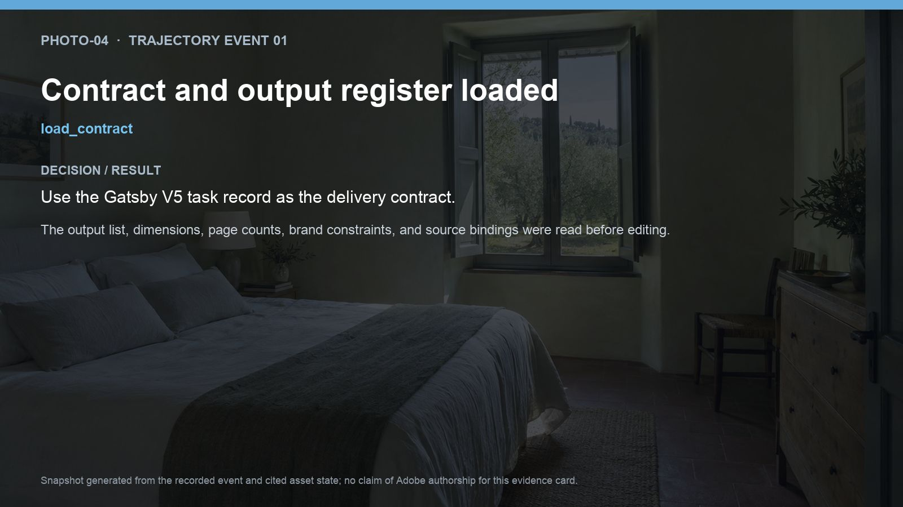

- **Action:** `load_contract`
- **Decision:** Use the Gatsby V5 task record as the delivery contract.
- **Parameters:** `{}`
- **Reasoning:** The output list, dimensions, page counts, brand constraints, and source bindings were read before editing.
- **Snapshot:** `trajectory/intermediate/01-contract-and-output-register-loaded.jpg` — 1600×900 JPEG, 114,877 bytes
- **SHA-256:** `65b24c5aa408c5b1eeee70f8b987a5c0db677b368403012adc5b79b4d779affe`
- **Same bytes as prior step:** `false`

### Stage 2 — Canonical source inventory

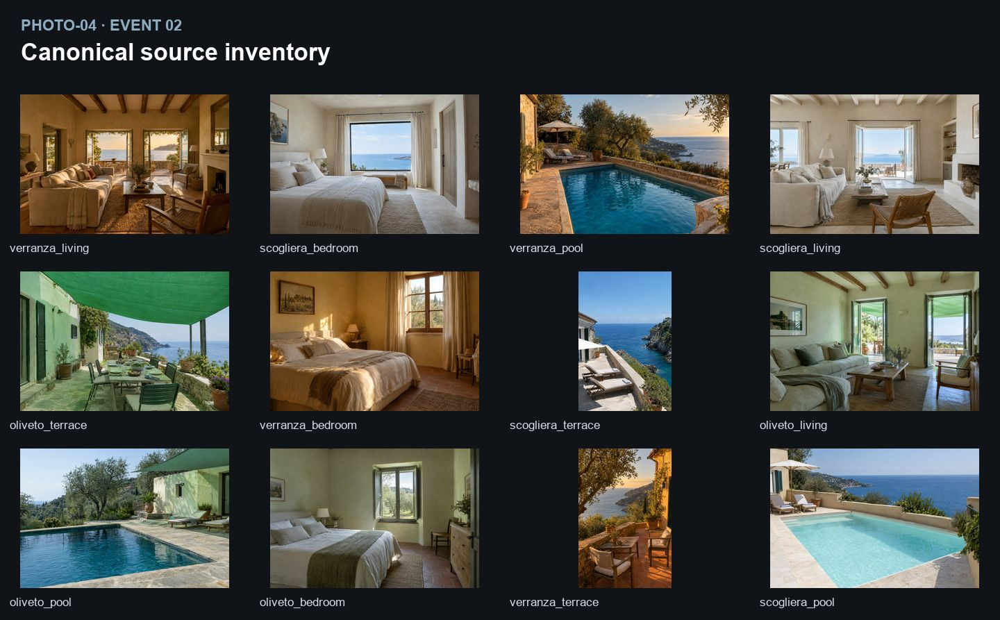

- **Action:** `bind_source_manifest`
- **Decision:** Bind exactly 12 approved photoreal inputs.
- **Parameters:** `{}`
- **Reasoning:** Every listed source matched the authoritative manifest SHA-256 and byte count.
- **Snapshot:** `trajectory/intermediate/02-canonical-source-inventory.jpg` — 1440×893 JPEG, 183,783 bytes
- **SHA-256:** `0a59984dcc075c663c1b5f02935fb3eb6e79147445e702578053543ee8714ff9`
- **Same bytes as prior step:** `false`

#### Underlying asset snapshots (12)

- [verranza_living.jpg](underlying/stage-02-canonical-source-inventory/001-urn-aaid-sc-va6c2-3f41f19c-6722-4f2a-83bc-f00dcdaf66fc-verranza-living-jpg.jpg) — asset `urn:aaid:sc:VA6C2:3f41f19c-6722-4f2a-83bc-f00dcdaf66fc`; 1600×1067 JPEG; `253d2ac79f8aca94516f2950f2c5c844a97aee08d582bac520cb9144ab611601`
- [scogliera_bedroom.jpg](underlying/stage-02-canonical-source-inventory/002-urn-aaid-sc-va6c2-dee788db-cf18-4e78-bbc6-86bc7527f9c8-scogliera-bedroom-jpg.jpg) — asset `urn:aaid:sc:VA6C2:dee788db-cf18-4e78-bbc6-86bc7527f9c8`; 1600×1067 JPEG; `acd80dd678ab5acbc33ae9539658c0cf34d09e5a842ac5b0e8821a0a492d9955`
- [verranza_pool.jpg](underlying/stage-02-canonical-source-inventory/003-urn-aaid-sc-va6c2-f0f970e1-786b-478f-affd-5aca8f4538af-verranza-pool-jpg.jpg) — asset `urn:aaid:sc:VA6C2:f0f970e1-786b-478f-affd-5aca8f4538af`; 1600×1067 JPEG; `ed00ef90fee3b6b7ca39feec878f6834379d35b0cd07562e367b17348e88a3b5`
- [scogliera_living.jpg](underlying/stage-02-canonical-source-inventory/004-urn-aaid-sc-va6c2-54b40ece-6fbb-4203-869a-9c8b3197a850-scogliera-living-jpg.jpg) — asset `urn:aaid:sc:VA6C2:54b40ece-6fbb-4203-869a-9c8b3197a850`; 1600×1067 JPEG; `4577b6b87e49229a30da61f3b02d78ef3f0ad0805a828ee33b052bf21eb95b0e`
- [oliveto_terrace.jpg](underlying/stage-02-canonical-source-inventory/005-urn-aaid-sc-va6c2-87142e53-4697-4dd3-b76a-85d8f8499c45-oliveto-terrace-jpg.jpg) — asset `urn:aaid:sc:VA6C2:87142e53-4697-4dd3-b76a-85d8f8499c45`; 1600×1067 JPEG; `be5d3045cad9cffffc9cb02cd29280d7421bcb0b6471d4de28996b9e3c20f510`
- [verranza_bedroom.jpg](underlying/stage-02-canonical-source-inventory/006-urn-aaid-sc-va6c2-ee161971-b729-4f25-ad92-16adbbfd44a9-verranza-bedroom-jpg.jpg) — asset `urn:aaid:sc:VA6C2:ee161971-b729-4f25-ad92-16adbbfd44a9`; 1600×1067 JPEG; `0bfd830af7caa4e6a1343aa77ae8f3bac53d865e918cf6211b165023dc4b6f73`
- [scogliera_terrace.jpg](underlying/stage-02-canonical-source-inventory/007-urn-aaid-sc-va6c2-25b7a14c-e8a0-4a31-bbd5-d68fdf5e56e8-scogliera-terrace-jpg.jpg) — asset `urn:aaid:sc:VA6C2:25b7a14c-e8a0-4a31-bbd5-d68fdf5e56e8`; 1067×1600 JPEG; `ad6271eca6bd3ea55af543254335c4e38d1df6e531d97f25ec7b45a9aa81e8ea`
- [oliveto_living.jpg](underlying/stage-02-canonical-source-inventory/008-urn-aaid-sc-va6c2-b15bff0f-ba85-418e-b063-6e3ae622d6d2-oliveto-living-jpg.jpg) — asset `urn:aaid:sc:VA6C2:b15bff0f-ba85-418e-b063-6e3ae622d6d2`; 1600×1067 JPEG; `7080ae81bf7facaff0bda53d70b76f6a36ecf0f17153550b75a87a32eef750ef`
- [oliveto_pool.jpg](underlying/stage-02-canonical-source-inventory/009-urn-aaid-sc-va6c2-092619c6-0696-4cd2-bf43-b768410f85ee-oliveto-pool-jpg.jpg) — asset `urn:aaid:sc:VA6C2:092619c6-0696-4cd2-bf43-b768410f85ee`; 1600×1067 JPEG; `2b1670678bf96428df9f97bf2006caddbc408ed3f68be92e8216112bb8fae7c1`
- [oliveto_bedroom.jpg](underlying/stage-02-canonical-source-inventory/010-urn-aaid-sc-va6c2-dcef1c78-652a-49a8-a6a1-961834fbc637-oliveto-bedroom-jpg.jpg) — asset `urn:aaid:sc:VA6C2:dcef1c78-652a-49a8-a6a1-961834fbc637`; 1600×1067 JPEG; `028a2de334a21812724871bc79c9e0251b183cc237dc3f8cf567fedb135a3187`
- [verranza_terrace.jpg](underlying/stage-02-canonical-source-inventory/011-urn-aaid-sc-va6c2-9d614579-8c5f-46de-8457-931b9d272946-verranza-terrace-jpg.jpg) — asset `urn:aaid:sc:VA6C2:9d614579-8c5f-46de-8457-931b9d272946`; 1067×1600 JPEG; `54eae2062182413bd971729034fe937850b874c00dd4be8a5a3450db7ca18497`
- [scogliera_pool.jpg](underlying/stage-02-canonical-source-inventory/012-urn-aaid-sc-va6c2-21c51f46-b4be-4c16-8fb7-87466e7324c9-scogliera-pool-jpg.jpg) — asset `urn:aaid:sc:VA6C2:21c51f46-b4be-4c16-8fb7-87466e7324c9`; 1600×1067 JPEG; `a92436e1f6ac884e63cb85e2cd243cd248d65cf99ad4ccd23e05191bd0c86a80`

### Stage 3 — Owner-note reconciliation

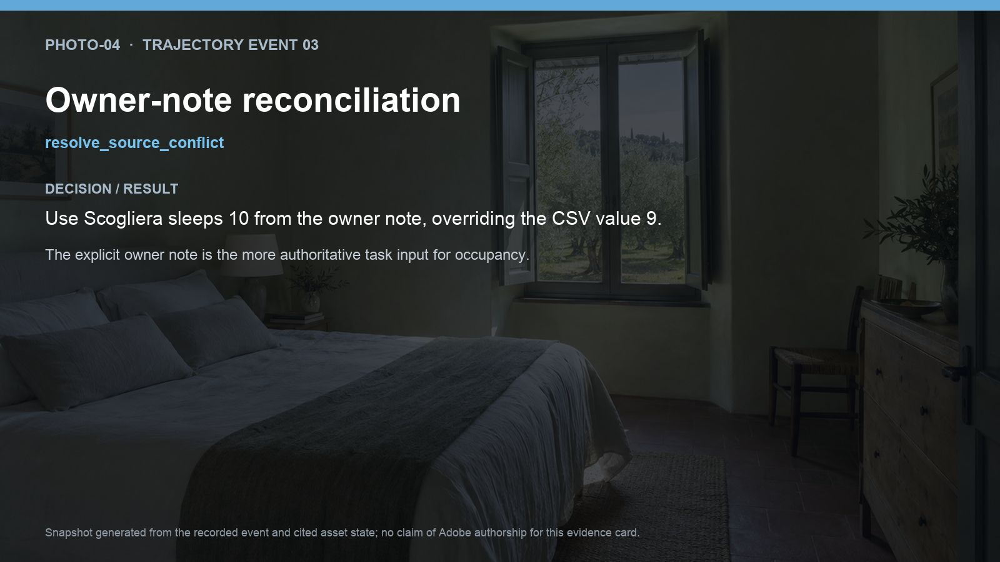

- **Action:** `resolve_source_conflict`
- **Decision:** Use Scogliera sleeps 10 from the owner note, overriding the CSV value 9.
- **Parameters:** `{}`
- **Reasoning:** The explicit owner note is the more authoritative task input for occupancy.
- **Snapshot:** `trajectory/intermediate/03-owner-note-reconciliation.jpg` — 1600×900 JPEG, 112,106 bytes
- **SHA-256:** `ffeebdc1fa5b67efcb11674b11c9d608514b62648229c7b722175ff8528d3d55`
- **Same bytes as prior step:** `false`

### Stage 4 — Collection scope normalized

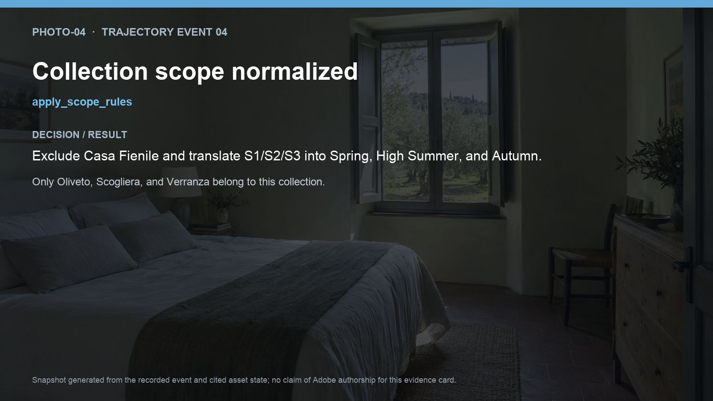

- **Action:** `apply_scope_rules`
- **Decision:** Exclude Casa Fienile and translate S1/S2/S3 into Spring, High Summer, and Autumn.
- **Parameters:** `{}`
- **Reasoning:** Only Oliveto, Scogliera, and Verranza belong to this collection.
- **Snapshot:** `trajectory/intermediate/04-collection-scope-normalized.jpg` — 1600×900 JPEG, 113,423 bytes
- **SHA-256:** `44e61d594fe81848412fdf2cea9abe1cf109cd2c2912ee10904487f716d67f6a`
- **Same bytes as prior step:** `false`

### Stage 5 — Creative constraints fixed

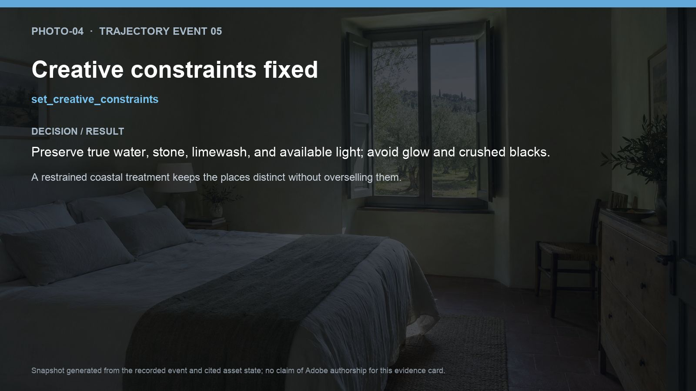

- **Action:** `set_creative_constraints`
- **Decision:** Preserve true water, stone, limewash, and available light; avoid glow and crushed blacks.
- **Parameters:** `{}`
- **Reasoning:** A restrained coastal treatment keeps the places distinct without overselling them.
- **Snapshot:** `trajectory/intermediate/05-creative-constraints-fixed.jpg` — 1600×900 JPEG, 114,850 bytes
- **SHA-256:** `4a1835c148b59f26e7fc1925006ced36d38eeab341538be23e82c0ec00a855ac`
- **Same bytes as prior step:** `false`

### Stage 6 — Representative preview selected

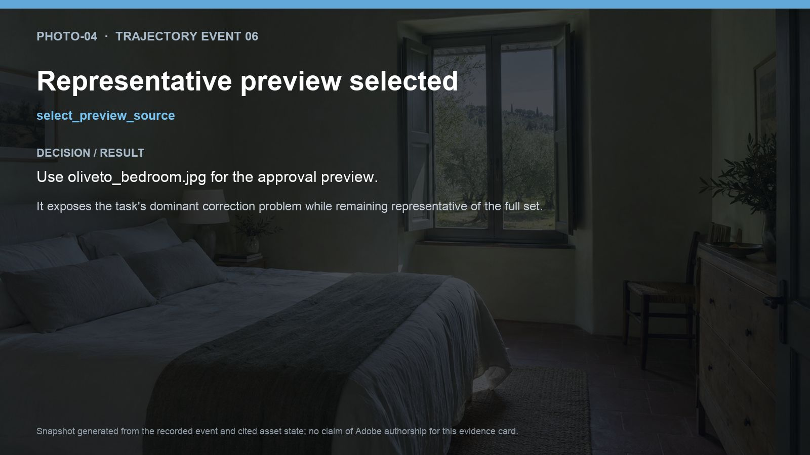

- **Action:** `select_preview_source`
- **Decision:** Use oliveto_bedroom.jpg for the approval preview.
- **Parameters:** `{}`
- **Reasoning:** It exposes the task's dominant correction problem while remaining representative of the full set.
- **Snapshot:** `trajectory/intermediate/06-representative-preview-selected.jpg` — 1600×900 JPEG, 114,277 bytes
- **SHA-256:** `23c67d4a25353844a0424767aca7f5e846eb390bcd44c9cf4d9431284d4e72ce`
- **Same bytes as prior step:** `false`

### Stage 7 — Source state diagnosed

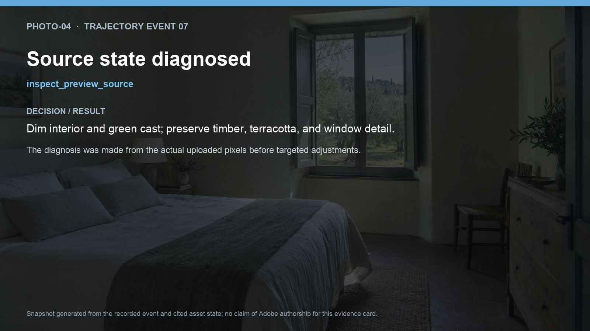

- **Action:** `inspect_preview_source`
- **Decision:** Dim interior and green cast; preserve timber, terracotta, and window detail.
- **Parameters:** `{}`
- **Reasoning:** The diagnosis was made from the actual uploaded pixels before targeted adjustments.
- **Snapshot:** `trajectory/intermediate/07-source-state-diagnosed.jpg` — 1600×900 JPEG, 112,893 bytes
- **SHA-256:** `d00bdca0d44015a71b7c70da647f481fc559cc3e858e90a5e44bc7469e05333a`
- **Same bytes as prior step:** `false`

### Stage 8 — Adobe workflow initialized

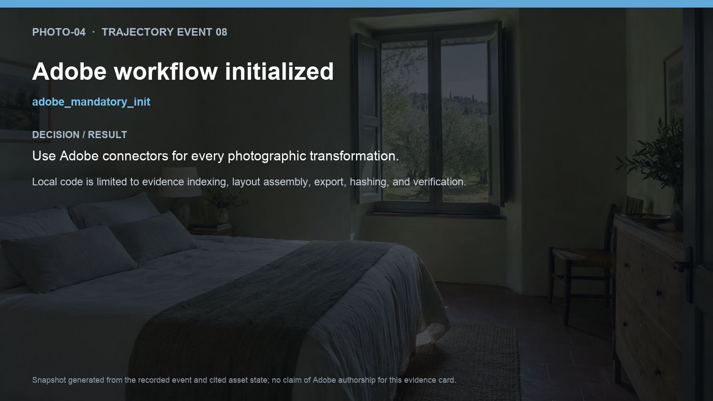

- **Action:** `adobe_mandatory_init`
- **Decision:** Use Adobe connectors for every photographic transformation.
- **Parameters:** `{}`
- **Reasoning:** Local code is limited to evidence indexing, layout assembly, export, hashing, and verification.
- **Snapshot:** `trajectory/intermediate/08-adobe-workflow-initialized.jpg` — 1600×900 JPEG, 112,758 bytes
- **SHA-256:** `c6077f9048d8fe3cb59eeb2e56d5eb4d5df0abe7b89d0d3fd61bd16de82d1059`
- **Same bytes as prior step:** `false`

### Stage 9 — Runtime preset catalog inspected

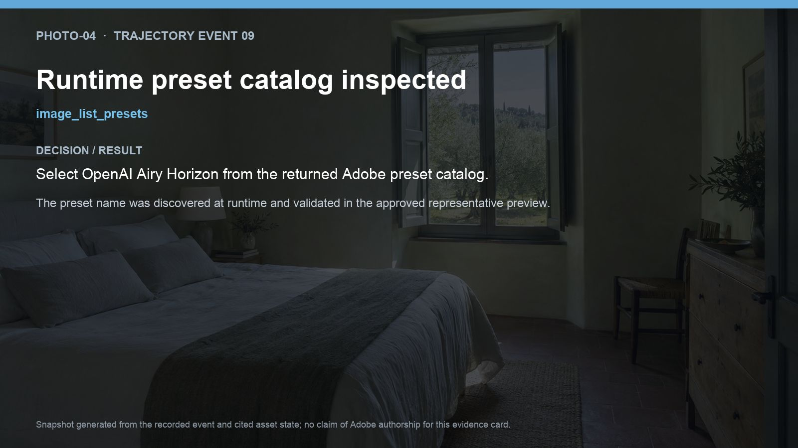

- **Action:** `image_list_presets`
- **Decision:** Select OpenAI Airy Horizon from the returned Adobe preset catalog.
- **Parameters:** `{"presetName": "OpenAI Airy Horizon"}`
- **Reasoning:** The preset name was discovered at runtime and validated in the approved representative preview.
- **Snapshot:** `trajectory/intermediate/09-runtime-preset-catalog-inspected.jpg` — 1600×900 JPEG, 115,619 bytes
- **SHA-256:** `971dcd30cf19267276828d55eaafffaf7e692ae9b80137a648258de6fe02db27`
- **Same bytes as prior step:** `false`

### Stage 10 — Sources ingested into Adobe

- **Action:** `asset_openai_file_upload`
- **Decision:** Upload all 22 canonical photographs in one connector call, then retain the returned Adobe asset IDs.
- **Parameters:** `{}`
- **Reasoning:** The public S3 host was rejected by Adobe, so verified local copies were uploaded through the connector.
- **Snapshot:** `trajectory/intermediate/10-sources-ingested-into-adobe.jpg` — 1440×893 JPEG, 184,205 bytes
- **SHA-256:** `a0e901149b565e340baaddabfe7854eb3cedcb2d3fd36e360b0d619b5cb6942c`
- **Same bytes as prior step:** `false`

#### Underlying asset snapshots (12)

- [verranza_living.jpg](underlying/stage-10-sources-ingested-into-adobe/001-urn-aaid-sc-va6c2-3f41f19c-6722-4f2a-83bc-f00dcdaf66fc-verranza-living-jpg.jpg) — asset `urn:aaid:sc:VA6C2:3f41f19c-6722-4f2a-83bc-f00dcdaf66fc`; 1600×1067 JPEG; `253d2ac79f8aca94516f2950f2c5c844a97aee08d582bac520cb9144ab611601`
- [scogliera_bedroom.jpg](underlying/stage-10-sources-ingested-into-adobe/002-urn-aaid-sc-va6c2-dee788db-cf18-4e78-bbc6-86bc7527f9c8-scogliera-bedroom-jpg.jpg) — asset `urn:aaid:sc:VA6C2:dee788db-cf18-4e78-bbc6-86bc7527f9c8`; 1600×1067 JPEG; `acd80dd678ab5acbc33ae9539658c0cf34d09e5a842ac5b0e8821a0a492d9955`
- [verranza_pool.jpg](underlying/stage-10-sources-ingested-into-adobe/003-urn-aaid-sc-va6c2-f0f970e1-786b-478f-affd-5aca8f4538af-verranza-pool-jpg.jpg) — asset `urn:aaid:sc:VA6C2:f0f970e1-786b-478f-affd-5aca8f4538af`; 1600×1067 JPEG; `ed00ef90fee3b6b7ca39feec878f6834379d35b0cd07562e367b17348e88a3b5`
- [scogliera_living.jpg](underlying/stage-10-sources-ingested-into-adobe/004-urn-aaid-sc-va6c2-54b40ece-6fbb-4203-869a-9c8b3197a850-scogliera-living-jpg.jpg) — asset `urn:aaid:sc:VA6C2:54b40ece-6fbb-4203-869a-9c8b3197a850`; 1600×1067 JPEG; `4577b6b87e49229a30da61f3b02d78ef3f0ad0805a828ee33b052bf21eb95b0e`
- [oliveto_terrace.jpg](underlying/stage-10-sources-ingested-into-adobe/005-urn-aaid-sc-va6c2-87142e53-4697-4dd3-b76a-85d8f8499c45-oliveto-terrace-jpg.jpg) — asset `urn:aaid:sc:VA6C2:87142e53-4697-4dd3-b76a-85d8f8499c45`; 1600×1067 JPEG; `be5d3045cad9cffffc9cb02cd29280d7421bcb0b6471d4de28996b9e3c20f510`
- [verranza_bedroom.jpg](underlying/stage-10-sources-ingested-into-adobe/006-urn-aaid-sc-va6c2-ee161971-b729-4f25-ad92-16adbbfd44a9-verranza-bedroom-jpg.jpg) — asset `urn:aaid:sc:VA6C2:ee161971-b729-4f25-ad92-16adbbfd44a9`; 1600×1067 JPEG; `0bfd830af7caa4e6a1343aa77ae8f3bac53d865e918cf6211b165023dc4b6f73`
- [scogliera_terrace.jpg](underlying/stage-10-sources-ingested-into-adobe/007-urn-aaid-sc-va6c2-25b7a14c-e8a0-4a31-bbd5-d68fdf5e56e8-scogliera-terrace-jpg.jpg) — asset `urn:aaid:sc:VA6C2:25b7a14c-e8a0-4a31-bbd5-d68fdf5e56e8`; 1067×1600 JPEG; `ad6271eca6bd3ea55af543254335c4e38d1df6e531d97f25ec7b45a9aa81e8ea`
- [oliveto_living.jpg](underlying/stage-10-sources-ingested-into-adobe/008-urn-aaid-sc-va6c2-b15bff0f-ba85-418e-b063-6e3ae622d6d2-oliveto-living-jpg.jpg) — asset `urn:aaid:sc:VA6C2:b15bff0f-ba85-418e-b063-6e3ae622d6d2`; 1600×1067 JPEG; `7080ae81bf7facaff0bda53d70b76f6a36ecf0f17153550b75a87a32eef750ef`
- [oliveto_pool.jpg](underlying/stage-10-sources-ingested-into-adobe/009-urn-aaid-sc-va6c2-092619c6-0696-4cd2-bf43-b768410f85ee-oliveto-pool-jpg.jpg) — asset `urn:aaid:sc:VA6C2:092619c6-0696-4cd2-bf43-b768410f85ee`; 1600×1067 JPEG; `2b1670678bf96428df9f97bf2006caddbc408ed3f68be92e8216112bb8fae7c1`
- [oliveto_bedroom.jpg](underlying/stage-10-sources-ingested-into-adobe/010-urn-aaid-sc-va6c2-dcef1c78-652a-49a8-a6a1-961834fbc637-oliveto-bedroom-jpg.jpg) — asset `urn:aaid:sc:VA6C2:dcef1c78-652a-49a8-a6a1-961834fbc637`; 1600×1067 JPEG; `028a2de334a21812724871bc79c9e0251b183cc237dc3f8cf567fedb135a3187`
- [verranza_terrace.jpg](underlying/stage-10-sources-ingested-into-adobe/011-urn-aaid-sc-va6c2-9d614579-8c5f-46de-8457-931b9d272946-verranza-terrace-jpg.jpg) — asset `urn:aaid:sc:VA6C2:9d614579-8c5f-46de-8457-931b9d272946`; 1067×1600 JPEG; `54eae2062182413bd971729034fe937850b874c00dd4be8a5a3450db7ca18497`
- [scogliera_pool.jpg](underlying/stage-10-sources-ingested-into-adobe/012-urn-aaid-sc-va6c2-21c51f46-b4be-4c16-8fb7-87466e7324c9-scogliera-pool-jpg.jpg) — asset `urn:aaid:sc:VA6C2:21c51f46-b4be-4c16-8fb7-87466e7324c9`; 1600×1067 JPEG; `a92436e1f6ac884e63cb85e2cd243cd248d65cf99ad4ccd23e05191bd0c86a80`

### Stage 11 — Preview downscale

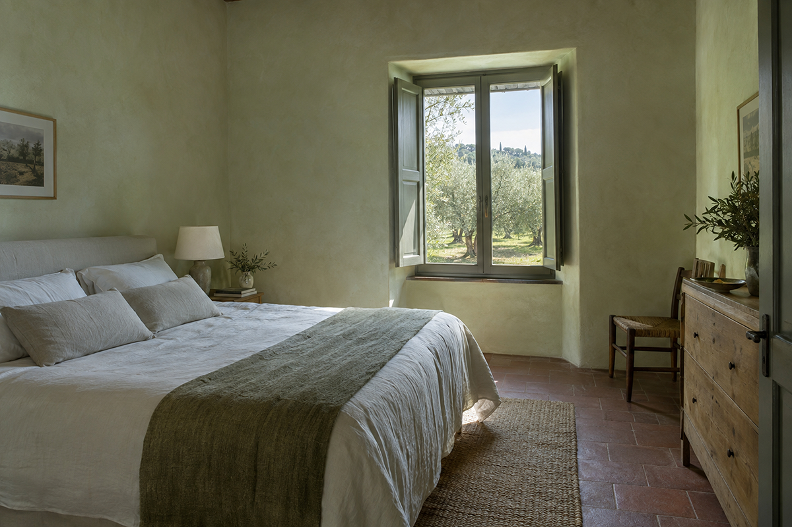

- **Action:** `image_crop_and_resize`
- **Decision:** Downscale proportionally for rapid review without changing aspect ratio.
- **Parameters:** `{}`
- **Reasoning:** The connector output was captured immediately and retained as its own trajectory state.
- **Snapshot:** `trajectory/intermediate/11-preview-downscale.png` — 1200×800 PNG, 1,492,425 bytes
- **SHA-256:** `9f369fbfdc4846b07726fef7572e96db817ea80293b0f639ab6b280b24cf79d8`
- **Same bytes as prior step:** `false`

### Stage 12 — Preview auto-straighten

- **Action:** `image_auto_straighten`
- **Decision:** Apply automatic leveling with constrained crop.
- **Parameters:** `{}`
- **Reasoning:** The connector output was captured immediately and retained as its own trajectory state.
- **Snapshot:** `trajectory/intermediate/12-preview-auto-straighten.png` — 1186×791 PNG, 1,435,542 bytes
- **SHA-256:** `444ff1b00abc43c748605c4d59fef98c58540fdd7007fdcc25ec929d6dcf9f07`
- **Same bytes as prior step:** `false`

### Stage 13 — Preview auto-tone

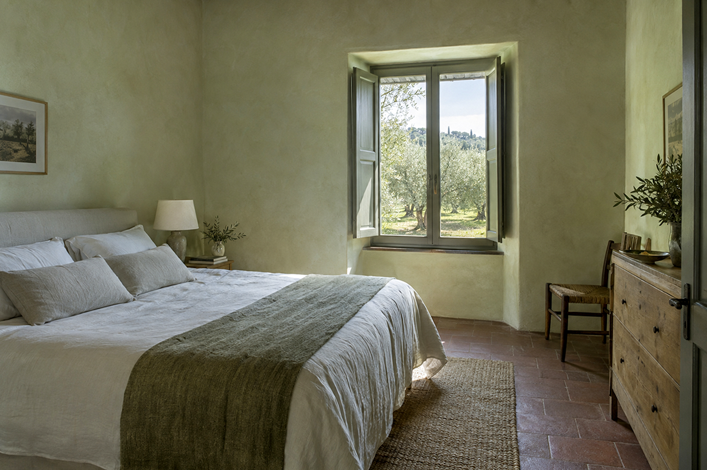

- **Action:** `image_apply_auto_tone`
- **Decision:** Establish a neutral tonal baseline before the creative grade.
- **Parameters:** `{}`
- **Reasoning:** The connector output was captured immediately and retained as its own trajectory state.
- **Snapshot:** `trajectory/intermediate/13-preview-auto-tone.png` — 1186×791 PNG, 1,565,112 bytes
- **SHA-256:** `0ca04f996bbddf26e40adfb07645842d783c037c13e6df0aa9d7cf0356b038ec`
- **Same bytes as prior step:** `false`

### Stage 14 — Preview task-specific look

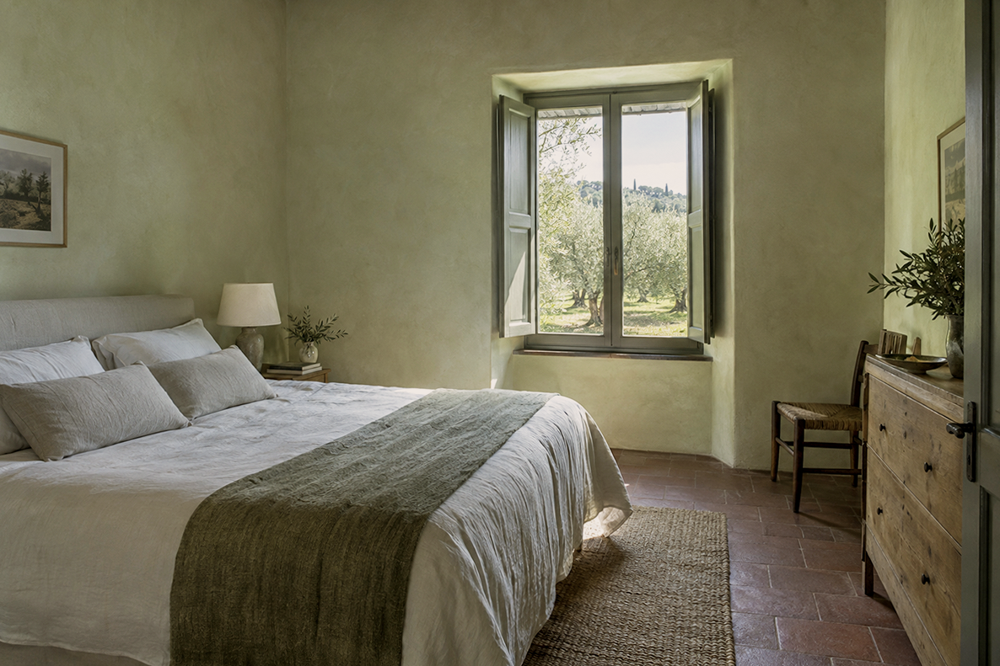

- **Action:** `image_apply_adjustments`
- **Decision:** Apply the proposed task-specific color and luminance correction.
- **Parameters:** `{}`
- **Reasoning:** The connector output was captured immediately and retained as its own trajectory state.
- **Snapshot:** `trajectory/intermediate/14-preview-task-specific-look.png` — 1186×791 PNG, 1,524,995 bytes
- **SHA-256:** `05c6d6c6e669288a77cec5885cfbf101515f4169d793ed7876ace90061cc8113`
- **Same bytes as prior step:** `false`

### Stage 15 — Preview Adobe preset

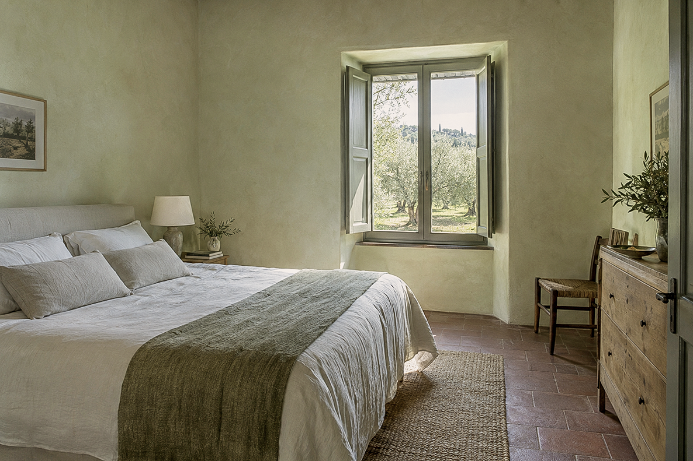

- **Action:** `image_apply_preset`
- **Decision:** Apply the catalog preset OpenAI Airy Horizon.
- **Parameters:** `{}`
- **Reasoning:** The connector output was captured immediately and retained as its own trajectory state.
- **Snapshot:** `trajectory/intermediate/15-preview-adobe-preset.png` — 1186×791 PNG, 1,793,853 bytes
- **SHA-256:** `cd20d44b92b345c367130f974344e3b899a17cefffb6271a5abeb4d9a03e6fe4`
- **Same bytes as prior step:** `false`

### Stage 16 — Preview highlight/shadow fine-tune

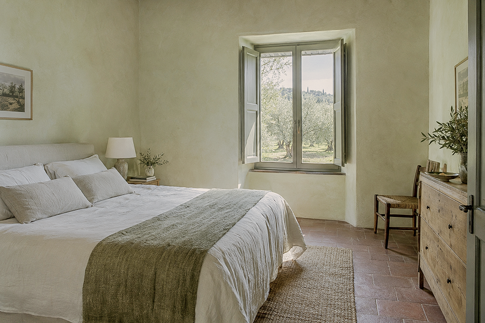

- **Action:** `image_apply_adjustments`
- **Decision:** Recover highlights and open dark regions with highlights -60 and darks +40.
- **Parameters:** `{}`
- **Reasoning:** The connector output was captured immediately and retained as its own trajectory state.
- **Snapshot:** `trajectory/intermediate/16-preview-highlight-shadow-fine-tune.png` — 1186×791 PNG, 1,716,254 bytes
- **SHA-256:** `954d70f1b549426a823aef5f63bbed619810089c0d8b778907fffe6ff2fc670e`
- **Same bytes as prior step:** `false`

### Stage 17 — Preview visually verified

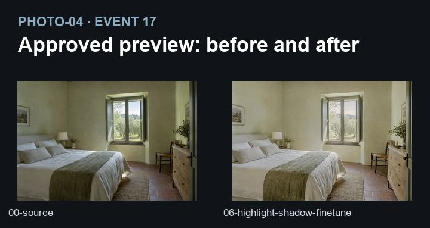

- **Action:** `visual_compare`
- **Decision:** Accept the proposed grade for full-batch application.
- **Parameters:** `{}`
- **Reasoning:** The after state improves tonal balance while retaining subject identity, texture, and detail.
- **Snapshot:** `trajectory/intermediate/17-preview-visually-verified.jpg` — 720×383 JPEG, 36,546 bytes
- **SHA-256:** `4cf95cec473ea9ac11c225bef50498ce74aedd1b37c2a459fd6ced7bc774a192`
- **Same bytes as prior step:** `false`

### Stage 18 — Explicit user approval captured

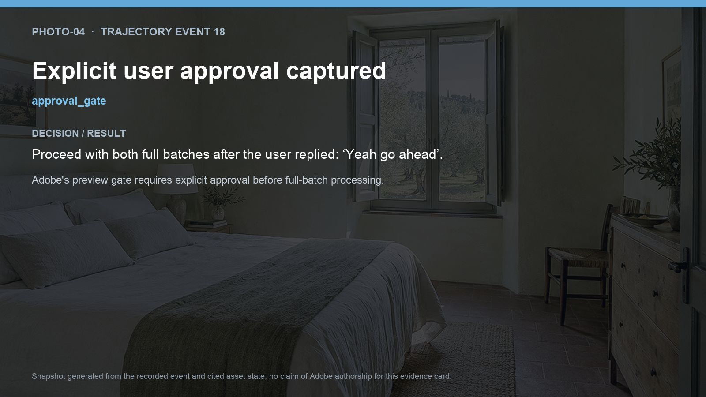

- **Action:** `approval_gate`
- **Decision:** Proceed with both full batches after the user replied: ‘Yeah go ahead’.
- **Parameters:** `{"approval": "Yeah go ahead"}`
- **Reasoning:** Adobe's preview gate requires explicit approval before full-batch processing.
- **Snapshot:** `trajectory/intermediate/18-explicit-user-approval-captured.jpg` — 1600×900 JPEG, 135,107 bytes
- **SHA-256:** `a238825b3e9c10ae6c5910e9e81316564e058ef3920d33ca3017d535d957356e`
- **Same bytes as prior step:** `false`

### Stage 19 — Full batch input state

- **Action:** `prepare_full_batch`
- **Decision:** Process all 12 task photographs.
- **Parameters:** `{}`
- **Reasoning:** The complete task inventory—not only the representative preview—entered the production run.
- **Snapshot:** `trajectory/intermediate/19-full-batch-input-state.jpg` — 1440×893 JPEG, 182,386 bytes
- **SHA-256:** `48fab7064fbe42dc90d5982eaccc6b8f05d84aae3cbd2c2076a3db2e4450a90f`
- **Same bytes as prior step:** `false`

#### Underlying asset snapshots (12)

- [verranza_living.jpg](underlying/stage-19-full-batch-input-state/001-urn-aaid-sc-va6c2-3f41f19c-6722-4f2a-83bc-f00dcdaf66fc-verranza-living-jpg.jpg) — asset `urn:aaid:sc:VA6C2:3f41f19c-6722-4f2a-83bc-f00dcdaf66fc`; 1600×1067 JPEG; `253d2ac79f8aca94516f2950f2c5c844a97aee08d582bac520cb9144ab611601`
- [scogliera_bedroom.jpg](underlying/stage-19-full-batch-input-state/002-urn-aaid-sc-va6c2-dee788db-cf18-4e78-bbc6-86bc7527f9c8-scogliera-bedroom-jpg.jpg) — asset `urn:aaid:sc:VA6C2:dee788db-cf18-4e78-bbc6-86bc7527f9c8`; 1600×1067 JPEG; `acd80dd678ab5acbc33ae9539658c0cf34d09e5a842ac5b0e8821a0a492d9955`
- [verranza_pool.jpg](underlying/stage-19-full-batch-input-state/003-urn-aaid-sc-va6c2-f0f970e1-786b-478f-affd-5aca8f4538af-verranza-pool-jpg.jpg) — asset `urn:aaid:sc:VA6C2:f0f970e1-786b-478f-affd-5aca8f4538af`; 1600×1067 JPEG; `ed00ef90fee3b6b7ca39feec878f6834379d35b0cd07562e367b17348e88a3b5`
- [scogliera_living.jpg](underlying/stage-19-full-batch-input-state/004-urn-aaid-sc-va6c2-54b40ece-6fbb-4203-869a-9c8b3197a850-scogliera-living-jpg.jpg) — asset `urn:aaid:sc:VA6C2:54b40ece-6fbb-4203-869a-9c8b3197a850`; 1600×1067 JPEG; `4577b6b87e49229a30da61f3b02d78ef3f0ad0805a828ee33b052bf21eb95b0e`
- [oliveto_terrace.jpg](underlying/stage-19-full-batch-input-state/005-urn-aaid-sc-va6c2-87142e53-4697-4dd3-b76a-85d8f8499c45-oliveto-terrace-jpg.jpg) — asset `urn:aaid:sc:VA6C2:87142e53-4697-4dd3-b76a-85d8f8499c45`; 1600×1067 JPEG; `be5d3045cad9cffffc9cb02cd29280d7421bcb0b6471d4de28996b9e3c20f510`
- [verranza_bedroom.jpg](underlying/stage-19-full-batch-input-state/006-urn-aaid-sc-va6c2-ee161971-b729-4f25-ad92-16adbbfd44a9-verranza-bedroom-jpg.jpg) — asset `urn:aaid:sc:VA6C2:ee161971-b729-4f25-ad92-16adbbfd44a9`; 1600×1067 JPEG; `0bfd830af7caa4e6a1343aa77ae8f3bac53d865e918cf6211b165023dc4b6f73`
- [scogliera_terrace.jpg](underlying/stage-19-full-batch-input-state/007-urn-aaid-sc-va6c2-25b7a14c-e8a0-4a31-bbd5-d68fdf5e56e8-scogliera-terrace-jpg.jpg) — asset `urn:aaid:sc:VA6C2:25b7a14c-e8a0-4a31-bbd5-d68fdf5e56e8`; 1067×1600 JPEG; `ad6271eca6bd3ea55af543254335c4e38d1df6e531d97f25ec7b45a9aa81e8ea`
- [oliveto_living.jpg](underlying/stage-19-full-batch-input-state/008-urn-aaid-sc-va6c2-b15bff0f-ba85-418e-b063-6e3ae622d6d2-oliveto-living-jpg.jpg) — asset `urn:aaid:sc:VA6C2:b15bff0f-ba85-418e-b063-6e3ae622d6d2`; 1600×1067 JPEG; `7080ae81bf7facaff0bda53d70b76f6a36ecf0f17153550b75a87a32eef750ef`
- [oliveto_pool.jpg](underlying/stage-19-full-batch-input-state/009-urn-aaid-sc-va6c2-092619c6-0696-4cd2-bf43-b768410f85ee-oliveto-pool-jpg.jpg) — asset `urn:aaid:sc:VA6C2:092619c6-0696-4cd2-bf43-b768410f85ee`; 1600×1067 JPEG; `2b1670678bf96428df9f97bf2006caddbc408ed3f68be92e8216112bb8fae7c1`
- [oliveto_bedroom.jpg](underlying/stage-19-full-batch-input-state/010-urn-aaid-sc-va6c2-dcef1c78-652a-49a8-a6a1-961834fbc637-oliveto-bedroom-jpg.jpg) — asset `urn:aaid:sc:VA6C2:dcef1c78-652a-49a8-a6a1-961834fbc637`; 1600×1067 JPEG; `028a2de334a21812724871bc79c9e0251b183cc237dc3f8cf567fedb135a3187`
- [verranza_terrace.jpg](underlying/stage-19-full-batch-input-state/011-urn-aaid-sc-va6c2-9d614579-8c5f-46de-8457-931b9d272946-verranza-terrace-jpg.jpg) — asset `urn:aaid:sc:VA6C2:9d614579-8c5f-46de-8457-931b9d272946`; 1067×1600 JPEG; `54eae2062182413bd971729034fe937850b874c00dd4be8a5a3450db7ca18497`
- [scogliera_pool.jpg](underlying/stage-19-full-batch-input-state/012-urn-aaid-sc-va6c2-21c51f46-b4be-4c16-8fb7-87466e7324c9-scogliera-pool-jpg.jpg) — asset `urn:aaid:sc:VA6C2:21c51f46-b4be-4c16-8fb7-87466e7324c9`; 1600×1067 JPEG; `a92436e1f6ac884e63cb85e2cd243cd248d65cf99ad4ccd23e05191bd0c86a80`

### Stage 20 — Initial batch truncation observed

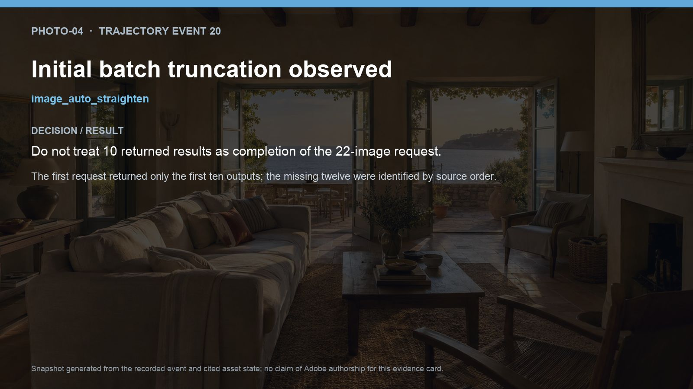

- **Action:** `image_auto_straighten`
- **Decision:** Do not treat 10 returned results as completion of the 22-image request.
- **Parameters:** `{}`
- **Reasoning:** The first request returned only the first ten outputs; the missing twelve were identified by source order.
- **Snapshot:** `trajectory/intermediate/20-initial-batch-truncation-observed.jpg` — 1600×900 JPEG, 142,196 bytes
- **SHA-256:** `647cd00f291702628c1f5ea605bc7e1f9cea1056266f6c2ccab656a7e9d162b5`
- **Same bytes as prior step:** `false`

### Stage 21 — Straighten retry chunking

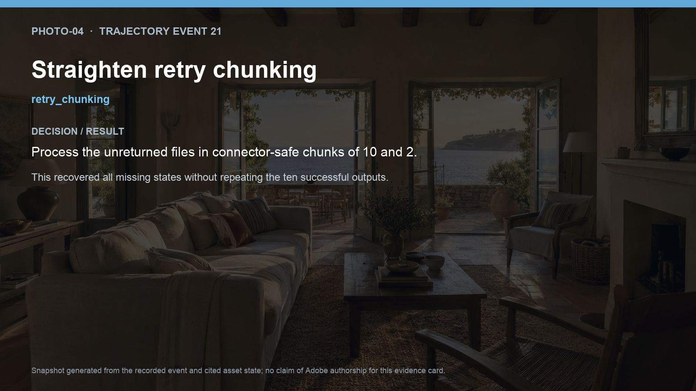

- **Action:** `retry_chunking`
- **Decision:** Process the unreturned files in connector-safe chunks of 10 and 2.
- **Parameters:** `{"chunks": [10, 2]}`
- **Reasoning:** This recovered all missing states without repeating the ten successful outputs.
- **Snapshot:** `trajectory/intermediate/21-straighten-retry-chunking.jpg` — 1600×900 JPEG, 135,472 bytes
- **SHA-256:** `a9f4dc2ce8caaa4fd0a2e70310425de82b64433fec7368896aaf80939f30feb3`
- **Same bytes as prior step:** `false`

### Stage 22 — Full batch straightened

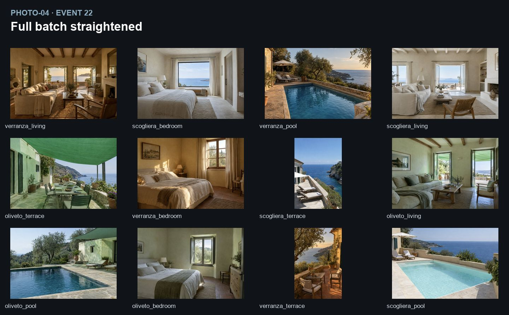

- **Action:** `image_auto_straighten`
- **Decision:** All 12 task files have a captured straightened state.
- **Parameters:** `{"constrainCrop": true, "uprightMode": "auto"}`
- **Reasoning:** Each individual output is linked beneath this derived contact sheet.
- **Snapshot:** `trajectory/intermediate/22-full-batch-straightened.jpg` — 1440×893 JPEG, 181,092 bytes
- **SHA-256:** `aa11a1d6d1f03da83454d2d59e40bc021e7b853d33c4b28964fa2b68c18212b0`
- **Same bytes as prior step:** `false`

#### Underlying asset snapshots (12)

- [verranza_living.png](underlying/stage-22-full-batch-straightened/001-photo-04-verranza-living-straighten-verranza-living-png.jpg) — asset `PHOTO-04-verranza_living-straighten`; 1600×1067 JPEG; `51bbb272086ec3058f41cf5d5dc14fd966e55bbebb4fd94ae4707de1e4184e2f`
- [scogliera_bedroom.png](underlying/stage-22-full-batch-straightened/002-photo-04-scogliera-bedroom-straighten-scogliera-bedroom-png.jpg) — asset `PHOTO-04-scogliera_bedroom-straighten`; 1600×1067 JPEG; `ed40b2d24769d9d15b7f3808539eb309f74327d93bc2e585d57511c342899c13`
- [verranza_pool.png](underlying/stage-22-full-batch-straightened/003-photo-04-verranza-pool-straighten-verranza-pool-png.jpg) — asset `PHOTO-04-verranza_pool-straighten`; 1600×1067 JPEG; `83f63812d24ff42bf37cece2d06182f755c8893a17705ff8a5211524415edeb8`
- [scogliera_living.png](underlying/stage-22-full-batch-straightened/004-photo-04-scogliera-living-straighten-scogliera-living-png.jpg) — asset `PHOTO-04-scogliera_living-straighten`; 1600×1067 JPEG; `8b01ccf224f5c07806ce7ecebb4bfb5f5ba522f97d9dd31295c7cdb9adfee559`
- [oliveto_terrace.png](underlying/stage-22-full-batch-straightened/005-photo-04-oliveto-terrace-straighten-oliveto-terrace-png.jpg) — asset `PHOTO-04-oliveto_terrace-straighten`; 1600×1067 JPEG; `1b00ba294dcc2c06917e4252cf26029446cddc24f0e2f2b1af3de6a2e03e13bc`
- [verranza_bedroom.png](underlying/stage-22-full-batch-straightened/006-photo-04-verranza-bedroom-straighten-verranza-bedroom-png.jpg) — asset `PHOTO-04-verranza_bedroom-straighten`; 1600×1067 JPEG; `b9f3b9b641b383456f21dadea9b0805a73953af09485e1667ed1d5231229609e`
- [scogliera_terrace.png](underlying/stage-22-full-batch-straightened/007-photo-04-scogliera-terrace-straighten-scogliera-terrace-png.jpg) — asset `PHOTO-04-scogliera_terrace-straighten`; 1067×1600 JPEG; `e702c68c6cc53303ad425ab937a17b72d5c773a3d1dbb3cd217736425d053af4`
- [oliveto_living.png](underlying/stage-22-full-batch-straightened/008-photo-04-oliveto-living-straighten-oliveto-living-png.jpg) — asset `PHOTO-04-oliveto_living-straighten`; 1600×1067 JPEG; `f314ea7c17964630f73b00fd4e9a0c0f1ec52a56f18652194b0fc12e244337d0`
- [oliveto_pool.png](underlying/stage-22-full-batch-straightened/009-photo-04-oliveto-pool-straighten-oliveto-pool-png.jpg) — asset `PHOTO-04-oliveto_pool-straighten`; 1600×1067 JPEG; `d2b442af019311cfbd412b6a2d10a6ee65d7f42a8323b96fa756f1f9b37d7de2`
- [oliveto_bedroom.png](underlying/stage-22-full-batch-straightened/010-photo-04-oliveto-bedroom-straighten-oliveto-bedroom-png.jpg) — asset `PHOTO-04-oliveto_bedroom-straighten`; 1600×1067 JPEG; `61c35e3ec2e219cf392146e74edce06c776b04ed5b7c5ba2781709317bb8cda8`
- [verranza_terrace.png](underlying/stage-22-full-batch-straightened/011-photo-04-verranza-terrace-straighten-verranza-terrace-png.jpg) — asset `PHOTO-04-verranza_terrace-straighten`; 1067×1600 JPEG; `8d0df51dc06c7d66bc47874807c4ee9390eb889de2a2a85dbbe46ebfde3bca56`
- [scogliera_pool.png](underlying/stage-22-full-batch-straightened/012-photo-04-scogliera-pool-straighten-scogliera-pool-png.jpg) — asset `PHOTO-04-scogliera_pool-straighten`; 1600×1067 JPEG; `f4f47a6b4eb5f84e063f5d330b2cbd2bb54bfd109d45137b93cccb30330ea256`

### Stage 23 — Local download DNS block

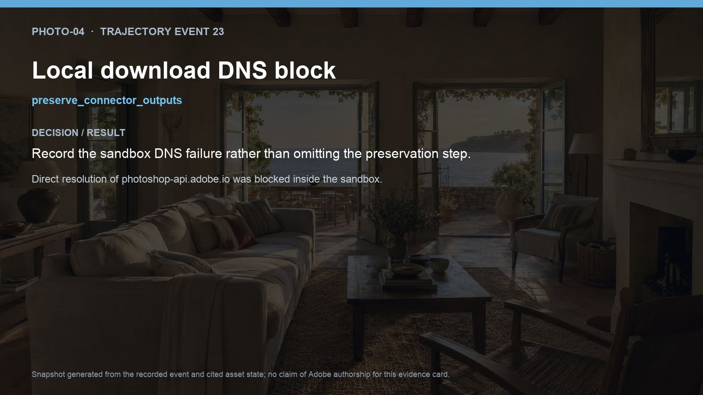

- **Action:** `preserve_connector_outputs`
- **Decision:** Record the sandbox DNS failure rather than omitting the preservation step.
- **Parameters:** `{}`
- **Reasoning:** Direct resolution of photoshop-api.adobe.io was blocked inside the sandbox.
- **Snapshot:** `trajectory/intermediate/23-local-download-dns-block.jpg` — 1600×900 JPEG, 138,534 bytes
- **SHA-256:** `3d6f87e3ffdc12ad56c34f1a038e1ccd2fa73a8dca2f959f1a7c1cc488628b5d`
- **Same bytes as prior step:** `false`

### Stage 24 — Parallel preservation recovery

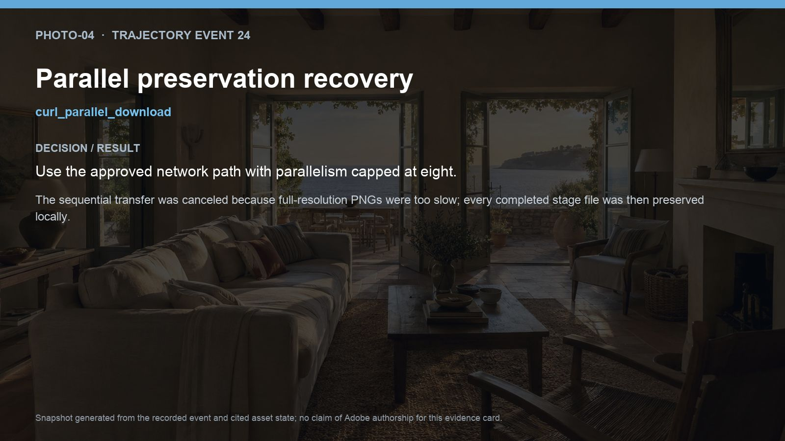

- **Action:** `curl_parallel_download`
- **Decision:** Use the approved network path with parallelism capped at eight.
- **Parameters:** `{"parallel_max": 8}`
- **Reasoning:** The sequential transfer was canceled because full-resolution PNGs were too slow; every completed stage file was then preserved locally.
- **Snapshot:** `trajectory/intermediate/24-parallel-preservation-recovery.jpg` — 1600×900 JPEG, 142,259 bytes
- **SHA-256:** `cfbaf50691b6976a2a2a16b888127e741589b34b9e116c64196128e63c1a5104`
- **Same bytes as prior step:** `false`

### Stage 25 — Concurrent auto-tone timeout

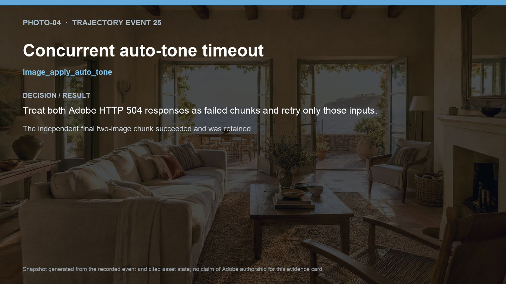

- **Action:** `image_apply_auto_tone`
- **Decision:** Treat both Adobe HTTP 504 responses as failed chunks and retry only those inputs.
- **Parameters:** `{}`
- **Reasoning:** The independent final two-image chunk succeeded and was retained.
- **Snapshot:** `trajectory/intermediate/25-concurrent-auto-tone-timeout.jpg` — 1600×900 JPEG, 154,137 bytes
- **SHA-256:** `abef3ced37fc974338039fcf4195983dd6d21cccb77babc0c9bfa0e2850f1611`
- **Same bytes as prior step:** `false`

### Stage 26 — Auto-tone recovery chunking

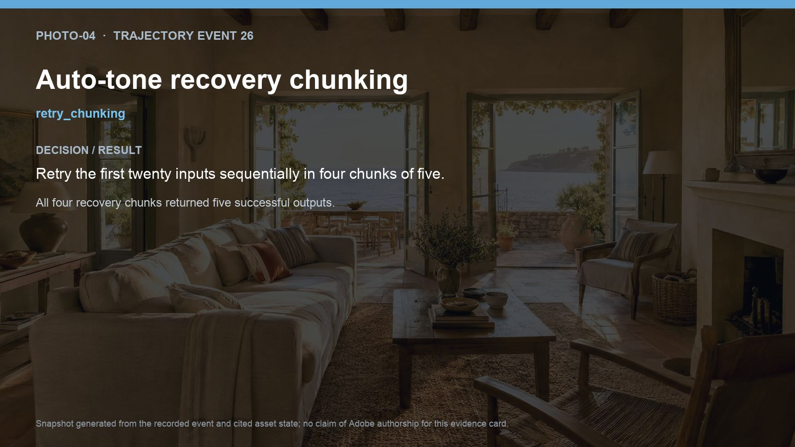

- **Action:** `retry_chunking`
- **Decision:** Retry the first twenty inputs sequentially in four chunks of five.
- **Parameters:** `{"chunks": [5, 5, 5, 5, 2]}`
- **Reasoning:** All four recovery chunks returned five successful outputs.
- **Snapshot:** `trajectory/intermediate/26-auto-tone-recovery-chunking.jpg` — 1600×900 JPEG, 149,563 bytes
- **SHA-256:** `c87024528268e57d823c63837dcc69130aff3cad8b8181d55a54c67dae25721a`
- **Same bytes as prior step:** `false`

### Stage 27 — Full batch auto-tone complete

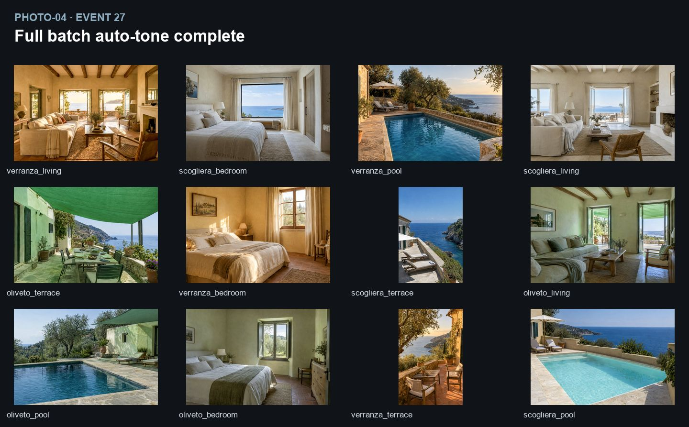

- **Action:** `image_apply_auto_tone`
- **Decision:** All 12 task files have a captured auto-tone state.
- **Parameters:** `{}`
- **Reasoning:** The neutral baseline is preserved separately from the subsequent creative treatment.
- **Snapshot:** `trajectory/intermediate/27-full-batch-auto-tone-complete.jpg` — 1440×893 JPEG, 192,421 bytes
- **SHA-256:** `cd1c5463c3cd3de1d6977f630a435d7e2da73f46ee2044eb1e024b6263df4481`
- **Same bytes as prior step:** `false`

#### Underlying asset snapshots (12)

- [verranza_living.png](underlying/stage-27-full-batch-auto-tone-complete/001-photo-04-verranza-living-auto-tone-verranza-living-png.jpg) — asset `PHOTO-04-verranza_living-auto_tone`; 1600×1067 JPEG; `fadb03164fd70ded8e486e9cbff3fb2184fb3180581b128e412770206910a7d3`
- [scogliera_bedroom.png](underlying/stage-27-full-batch-auto-tone-complete/002-photo-04-scogliera-bedroom-auto-tone-scogliera-bedroom-png.jpg) — asset `PHOTO-04-scogliera_bedroom-auto_tone`; 1600×1067 JPEG; `df5a5a84d8e1f9004a2d4c2ce7e3e88a3643a5eee9760e77f2769a40ea530df3`
- [verranza_pool.png](underlying/stage-27-full-batch-auto-tone-complete/003-photo-04-verranza-pool-auto-tone-verranza-pool-png.jpg) — asset `PHOTO-04-verranza_pool-auto_tone`; 1600×1067 JPEG; `0f3f9698c068834d5a9f78735a7ecc90760a52c6096fe617adee97f63952d4e5`
- [scogliera_living.png](underlying/stage-27-full-batch-auto-tone-complete/004-photo-04-scogliera-living-auto-tone-scogliera-living-png.jpg) — asset `PHOTO-04-scogliera_living-auto_tone`; 1600×1067 JPEG; `71600b357d0d731bc89292430374fa801a0ca81183cf9607bf62e09d3d6d34bf`
- [oliveto_terrace.png](underlying/stage-27-full-batch-auto-tone-complete/005-photo-04-oliveto-terrace-auto-tone-oliveto-terrace-png.jpg) — asset `PHOTO-04-oliveto_terrace-auto_tone`; 1600×1067 JPEG; `7037ce4b9aa50b1fe1a986fc74999fad8f81b447092e1ba5ee1600bdb46db587`
- [verranza_bedroom.png](underlying/stage-27-full-batch-auto-tone-complete/006-photo-04-verranza-bedroom-auto-tone-verranza-bedroom-png.jpg) — asset `PHOTO-04-verranza_bedroom-auto_tone`; 1600×1067 JPEG; `38dfc6e8fa92ab3b20d59d2b20d05cfe3ca70cfacc9153405ce1a7bc3053f7a6`
- [scogliera_terrace.png](underlying/stage-27-full-batch-auto-tone-complete/007-photo-04-scogliera-terrace-auto-tone-scogliera-terrace-png.jpg) — asset `PHOTO-04-scogliera_terrace-auto_tone`; 1067×1600 JPEG; `f9f694ca12c965598fae4b3a8262110e42239a0e88a27ecca85940707f0c5e98`
- [oliveto_living.png](underlying/stage-27-full-batch-auto-tone-complete/008-photo-04-oliveto-living-auto-tone-oliveto-living-png.jpg) — asset `PHOTO-04-oliveto_living-auto_tone`; 1600×1067 JPEG; `3d95a0535bcd60549955fa8b583922245981d4a3f2192e708cade617f69a7807`
- [oliveto_pool.png](underlying/stage-27-full-batch-auto-tone-complete/009-photo-04-oliveto-pool-auto-tone-oliveto-pool-png.jpg) — asset `PHOTO-04-oliveto_pool-auto_tone`; 1600×1067 JPEG; `d31d9ad1c709de9457e4f6ef6a64810ab0c145be6b758db4ddae1d39304caa60`
- [oliveto_bedroom.png](underlying/stage-27-full-batch-auto-tone-complete/010-photo-04-oliveto-bedroom-auto-tone-oliveto-bedroom-png.jpg) — asset `PHOTO-04-oliveto_bedroom-auto_tone`; 1600×1067 JPEG; `00bc34698b08895804bcf08f41f32cbc082aa5adbc6a3ac393ccb379432f20ab`
- [verranza_terrace.png](underlying/stage-27-full-batch-auto-tone-complete/011-photo-04-verranza-terrace-auto-tone-verranza-terrace-png.jpg) — asset `PHOTO-04-verranza_terrace-auto_tone`; 1067×1600 JPEG; `a0ff5ad914d6f6fa18408ee895a740db3d31e3bcfb1f7b4d523a516a59d520de`
- [scogliera_pool.png](underlying/stage-27-full-batch-auto-tone-complete/012-photo-04-scogliera-pool-auto-tone-scogliera-pool-png.jpg) — asset `PHOTO-04-scogliera_pool-auto_tone`; 1600×1067 JPEG; `8b18378a22cecc6e40f4e628292511361ed9593101290ed9ce54d99aeef8b283`

### Stage 28 — Approved look applied

- **Action:** `image_apply_adjustments`
- **Decision:** Apply the approved PHOTO-04 look parameters to every task image.
- **Parameters:** `{"brightness": 15, "saturation": -10, "tempA": 20, "tempB": 60, "tempLuminance": 62, "vibrance": 10}`
- **Reasoning:** Inputs were visually inspected immediately before the connector adjustment calls.
- **Snapshot:** `trajectory/intermediate/28-approved-look-applied.jpg` — 1440×893 JPEG, 188,428 bytes
- **SHA-256:** `901dafe42c6d44edd2f64f36f40681e9dbac43a2aaaf98cd4a4372d28eb87d5b`
- **Same bytes as prior step:** `false`

#### Underlying asset snapshots (12)

- [verranza_living.png](underlying/stage-28-approved-look-applied/001-photo-04-verranza-living-look-verranza-living-png.jpg) — asset `PHOTO-04-verranza_living-look`; 1600×1067 JPEG; `fa5e11ae666fe26cfa274124803f23942c8d005ea404f5d895a961ade91a6864`
- [scogliera_bedroom.png](underlying/stage-28-approved-look-applied/002-photo-04-scogliera-bedroom-look-scogliera-bedroom-png.jpg) — asset `PHOTO-04-scogliera_bedroom-look`; 1600×1067 JPEG; `b73efc5131b087cc052fb6f663de438f77f481ef2c69345105fb6d75e4b0faa0`
- [verranza_pool.png](underlying/stage-28-approved-look-applied/003-photo-04-verranza-pool-look-verranza-pool-png.jpg) — asset `PHOTO-04-verranza_pool-look`; 1600×1067 JPEG; `17de98faae273cda9e1a6dbccbec07cc376958893fec281cc1dfa183fea1429d`
- [scogliera_living.png](underlying/stage-28-approved-look-applied/004-photo-04-scogliera-living-look-scogliera-living-png.jpg) — asset `PHOTO-04-scogliera_living-look`; 1600×1067 JPEG; `f6683dfbe79fc5e3e8d3b99f5f34901c9c41aa3afeb14b922475ce60246cb81f`
- [oliveto_terrace.png](underlying/stage-28-approved-look-applied/005-photo-04-oliveto-terrace-look-oliveto-terrace-png.jpg) — asset `PHOTO-04-oliveto_terrace-look`; 1600×1067 JPEG; `5c8b86a0fe195d683ad21248db199b3bb2f285a4ec7b5d2f634cda586415e777`
- [verranza_bedroom.png](underlying/stage-28-approved-look-applied/006-photo-04-verranza-bedroom-look-verranza-bedroom-png.jpg) — asset `PHOTO-04-verranza_bedroom-look`; 1600×1067 JPEG; `9be63546cd00f447f54b6d2fdd05f597e4d6494f860ce96c2140bf6df0c79143`
- [scogliera_terrace.png](underlying/stage-28-approved-look-applied/007-photo-04-scogliera-terrace-look-scogliera-terrace-png.jpg) — asset `PHOTO-04-scogliera_terrace-look`; 1067×1600 JPEG; `1687c117f51953fe910a0e102407f9865a4361a05ecb86de87d0c987a868e78a`
- [oliveto_living.png](underlying/stage-28-approved-look-applied/008-photo-04-oliveto-living-look-oliveto-living-png.jpg) — asset `PHOTO-04-oliveto_living-look`; 1600×1067 JPEG; `112f1e1fa34771627679dfd3208be05cf4847c4ef82adb6f3168d8370f344ff6`
- [oliveto_pool.png](underlying/stage-28-approved-look-applied/009-photo-04-oliveto-pool-look-oliveto-pool-png.jpg) — asset `PHOTO-04-oliveto_pool-look`; 1600×1067 JPEG; `6ecc4d26c8a97b132b0da606e6ac098a1593f8b4ffb84c2c36249a533de0e2a4`
- [oliveto_bedroom.png](underlying/stage-28-approved-look-applied/010-photo-04-oliveto-bedroom-look-oliveto-bedroom-png.jpg) — asset `PHOTO-04-oliveto_bedroom-look`; 1600×1067 JPEG; `25e11b2f7dec53270bdd7ee28f67e797c23490f6bc06a72beaa4beebbdd1ff19`
- [verranza_terrace.png](underlying/stage-28-approved-look-applied/011-photo-04-verranza-terrace-look-verranza-terrace-png.jpg) — asset `PHOTO-04-verranza_terrace-look`; 1067×1600 JPEG; `64d22b7daaf2bb8effa6e9c7bf8643040ef53037842fdc43ec14669b919f22a6`
- [scogliera_pool.png](underlying/stage-28-approved-look-applied/012-photo-04-scogliera-pool-look-scogliera-pool-png.jpg) — asset `PHOTO-04-scogliera_pool-look`; 1600×1067 JPEG; `25f7d08dc0b12fa59e258674dfed25683e2295b27d8f587a6948829c37f7551a`

### Stage 29 — Approved preset applied

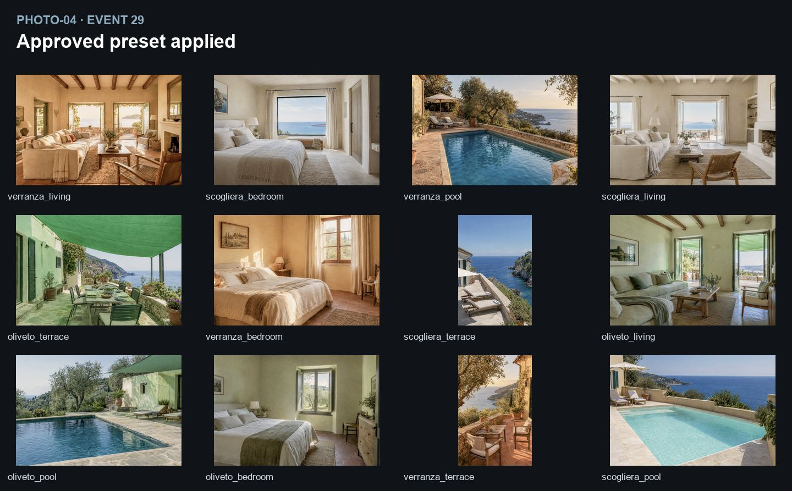

- **Action:** `image_apply_preset`
- **Decision:** Apply OpenAI Airy Horizon once to every look-adjusted task image.
- **Parameters:** `{"presetName": "OpenAI Airy Horizon"}`
- **Reasoning:** A single preset was used as a complete look; presets were not stacked.
- **Snapshot:** `trajectory/intermediate/29-approved-preset-applied.jpg` — 1440×893 JPEG, 186,958 bytes
- **SHA-256:** `4329a7b6963e39bf9a5648e3ed7765ca173dab88252278493b08b640be5c33dd`
- **Same bytes as prior step:** `false`

#### Underlying asset snapshots (12)

- [verranza_living.png](underlying/stage-29-approved-preset-applied/001-photo-04-verranza-living-preset-verranza-living-png.jpg) — asset `PHOTO-04-verranza_living-preset`; 1600×1067 JPEG; `970de0ccf8ece91e22d5053473ce74b663ac7785fe4ee4e9b7a4c1752a9f3c63`
- [scogliera_bedroom.png](underlying/stage-29-approved-preset-applied/002-photo-04-scogliera-bedroom-preset-scogliera-bedroom-png.jpg) — asset `PHOTO-04-scogliera_bedroom-preset`; 1600×1067 JPEG; `c980e10a6046836c83033aa4fb0c76433c8eea7875e47ca75ba6de77462e48f4`
- [verranza_pool.png](underlying/stage-29-approved-preset-applied/003-photo-04-verranza-pool-preset-verranza-pool-png.jpg) — asset `PHOTO-04-verranza_pool-preset`; 1600×1067 JPEG; `1dbe8dc89998b1118d2acc5101af570989319115b830f502f1bef91da6bbfa58`
- [scogliera_living.png](underlying/stage-29-approved-preset-applied/004-photo-04-scogliera-living-preset-scogliera-living-png.jpg) — asset `PHOTO-04-scogliera_living-preset`; 1600×1067 JPEG; `9a1b84d106fe3ad20c13d16d2e365d946a78cf9fd1ca51ea79734a2bb3417297`
- [oliveto_terrace.png](underlying/stage-29-approved-preset-applied/005-photo-04-oliveto-terrace-preset-oliveto-terrace-png.jpg) — asset `PHOTO-04-oliveto_terrace-preset`; 1600×1067 JPEG; `c3f35e32102d2f135a2f65900597ba4fd213fec5bcfc6f9019fc39ac2a98a082`
- [verranza_bedroom.png](underlying/stage-29-approved-preset-applied/006-photo-04-verranza-bedroom-preset-verranza-bedroom-png.jpg) — asset `PHOTO-04-verranza_bedroom-preset`; 1600×1067 JPEG; `1fc7bd1c82bc2735b29054146095001ade017d546f24192e605147b522eb6032`
- [scogliera_terrace.png](underlying/stage-29-approved-preset-applied/007-photo-04-scogliera-terrace-preset-scogliera-terrace-png.jpg) — asset `PHOTO-04-scogliera_terrace-preset`; 1067×1600 JPEG; `f67a6f2d3ceeb74f482339dda4e3337784d73119032a98cf83b225f9eafa543a`
- [oliveto_living.png](underlying/stage-29-approved-preset-applied/008-photo-04-oliveto-living-preset-oliveto-living-png.jpg) — asset `PHOTO-04-oliveto_living-preset`; 1600×1067 JPEG; `8f8637f17bb88ef5d00058fdc473ee468971e6ed73776f980dbbae8bc8b45f9b`
- [oliveto_pool.png](underlying/stage-29-approved-preset-applied/009-photo-04-oliveto-pool-preset-oliveto-pool-png.jpg) — asset `PHOTO-04-oliveto_pool-preset`; 1600×1067 JPEG; `9140801be5cde5cbc171015c27165696037823bd9535be51e6fdb3717421d797`
- [oliveto_bedroom.png](underlying/stage-29-approved-preset-applied/010-photo-04-oliveto-bedroom-preset-oliveto-bedroom-png.jpg) — asset `PHOTO-04-oliveto_bedroom-preset`; 1600×1067 JPEG; `bb1ba1c6273a89cf00e597a0622087a13213c688e68dfed151717923a5e413ef`
- [verranza_terrace.png](underlying/stage-29-approved-preset-applied/011-photo-04-verranza-terrace-preset-verranza-terrace-png.jpg) — asset `PHOTO-04-verranza_terrace-preset`; 1067×1600 JPEG; `06b1dc461eeefc49807825764c48c8d761e9ed629f839ebaad7d920c7b96d106`
- [scogliera_pool.png](underlying/stage-29-approved-preset-applied/012-photo-04-scogliera-pool-preset-scogliera-pool-png.jpg) — asset `PHOTO-04-scogliera_pool-preset`; 1600×1067 JPEG; `c8f174564e97e289a8df1ff5bf6a0ab121de8b6db8a67a71752a7e46e1844b99`

### Stage 30 — Highlight/shadow fine-tune complete

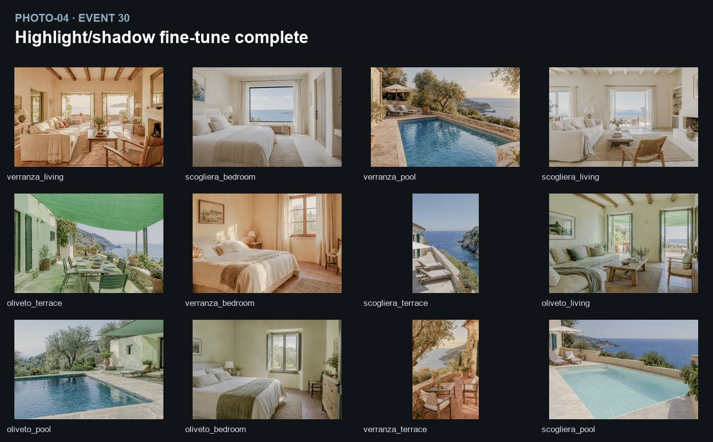

- **Action:** `image_apply_adjustments`
- **Decision:** All 12 final Adobe states are captured.
- **Parameters:** `{"darks": 40, "highlights": -60}`
- **Reasoning:** The preset outputs were visually inspected immediately before this final adjustment.
- **Snapshot:** `trajectory/intermediate/30-highlight-shadow-fine-tune-complete.jpg` — 1440×893 JPEG, 176,210 bytes
- **SHA-256:** `88374f676f68521dbe5abf57d792abbd32707bee94bf52d7cb229adff94f6f61`
- **Same bytes as prior step:** `false`

#### Underlying asset snapshots (12)

- [verranza_living.png](underlying/stage-30-highlight-shadow-fine-tune-complete/001-photo-04-verranza-living-fine-tune-verranza-living-png.jpg) — asset `PHOTO-04-verranza_living-fine_tune`; 1600×1067 JPEG; `37c92e2692901ad2d3e39306af2f1d6660fed89dda88163d3a688f64c6bdf63e`
- [scogliera_bedroom.png](underlying/stage-30-highlight-shadow-fine-tune-complete/002-photo-04-scogliera-bedroom-fine-tune-scogliera-bedroom-png.jpg) — asset `PHOTO-04-scogliera_bedroom-fine_tune`; 1600×1067 JPEG; `152b80596de9c198c5925872d3ee610049017d6f6b38e7c0b42dbe50dfa5d4f0`
- [verranza_pool.png](underlying/stage-30-highlight-shadow-fine-tune-complete/003-photo-04-verranza-pool-fine-tune-verranza-pool-png.jpg) — asset `PHOTO-04-verranza_pool-fine_tune`; 1600×1067 JPEG; `07168c5162b5400f5bcbe08859f40d24f32d796b82e058e2527198f543b694cb`
- [scogliera_living.png](underlying/stage-30-highlight-shadow-fine-tune-complete/004-photo-04-scogliera-living-fine-tune-scogliera-living-png.jpg) — asset `PHOTO-04-scogliera_living-fine_tune`; 1600×1067 JPEG; `f355295dd4b792229541fe13fd17bf8dd894ed0b420df8555c5330dbf6111484`
- [oliveto_terrace.png](underlying/stage-30-highlight-shadow-fine-tune-complete/005-photo-04-oliveto-terrace-fine-tune-oliveto-terrace-png.jpg) — asset `PHOTO-04-oliveto_terrace-fine_tune`; 1600×1067 JPEG; `3af5b35240d7f8b0d34e88d5d663e3b1b70e0ab8f0fe0bc16abaaa13617a87b2`
- [verranza_bedroom.png](underlying/stage-30-highlight-shadow-fine-tune-complete/006-photo-04-verranza-bedroom-fine-tune-verranza-bedroom-png.jpg) — asset `PHOTO-04-verranza_bedroom-fine_tune`; 1600×1067 JPEG; `cb275ce7820692ed6c2761573820e2eacf89883a2096a8188a3345dd4607092c`
- [scogliera_terrace.png](underlying/stage-30-highlight-shadow-fine-tune-complete/007-photo-04-scogliera-terrace-fine-tune-scogliera-terrace-png.jpg) — asset `PHOTO-04-scogliera_terrace-fine_tune`; 1067×1600 JPEG; `4496a9757d1a5acadb9335e0cd9b07ef5adc65e0ddb7820492a7cc45e8f79ba1`
- [oliveto_living.png](underlying/stage-30-highlight-shadow-fine-tune-complete/008-photo-04-oliveto-living-fine-tune-oliveto-living-png.jpg) — asset `PHOTO-04-oliveto_living-fine_tune`; 1600×1067 JPEG; `d614221cb79b96f3d60603779cbe22acb1ed8c98f46654c975f20f7dd2622c83`
- [oliveto_pool.png](underlying/stage-30-highlight-shadow-fine-tune-complete/009-photo-04-oliveto-pool-fine-tune-oliveto-pool-png.jpg) — asset `PHOTO-04-oliveto_pool-fine_tune`; 1600×1067 JPEG; `c77f04300f9cce0e662a098956b0ee13539eb2699a52281fc0657ea5a2eae09d`
- [oliveto_bedroom.png](underlying/stage-30-highlight-shadow-fine-tune-complete/010-photo-04-oliveto-bedroom-fine-tune-oliveto-bedroom-png.jpg) — asset `PHOTO-04-oliveto_bedroom-fine_tune`; 1600×1067 JPEG; `8ba56ec3800cc4bdebd9254f070cdcec9b85e23fa50fd9d4aee1d864a669e429`
- [verranza_terrace.png](underlying/stage-30-highlight-shadow-fine-tune-complete/011-photo-04-verranza-terrace-fine-tune-verranza-terrace-png.jpg) — asset `PHOTO-04-verranza_terrace-fine_tune`; 1067×1600 JPEG; `d13fbd4e89586bb01978f38af60d289696eb4c4d0bdc36d2ca7a07ce01a8e2dc`
- [scogliera_pool.png](underlying/stage-30-highlight-shadow-fine-tune-complete/012-photo-04-scogliera-pool-fine-tune-scogliera-pool-png.jpg) — asset `PHOTO-04-scogliera_pool-fine_tune`; 1600×1067 JPEG; `993845a93f7b62fcf5ec8fce8a357e13bb7174f74f2d28f733540be8f234fbe8`

### Stage 31 — Full graded-set visual QA

- **Action:** `visual_quality_review`
- **Decision:** Accept the complete graded set for layout assembly.
- **Parameters:** `{}`
- **Reasoning:** The review checked material/color identity, clipping, highlight detail, shadow detail, and composition continuity.
- **Snapshot:** `trajectory/intermediate/31-full-graded-set-visual-qa.jpg` — 1440×893 JPEG, 173,707 bytes
- **SHA-256:** `18f219a394c4fd79cdebfe84a9ff972ec144f3d466f9fd5edad2a796782fd2a6`
- **Same bytes as prior step:** `false`

### Stage 32 — Pool hero frames selected

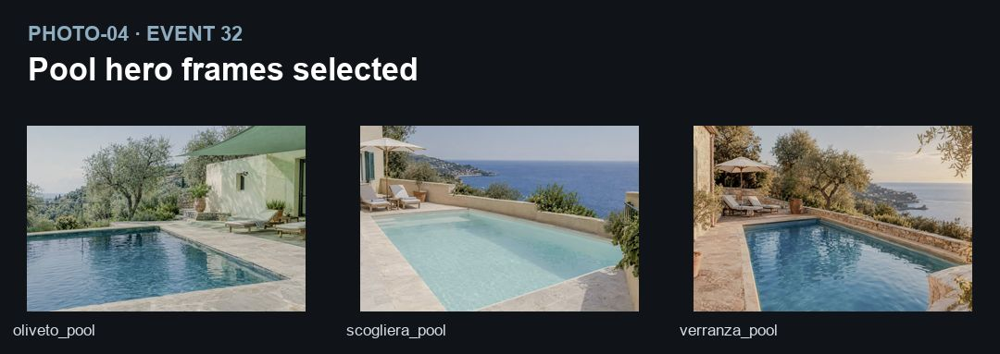

- **Action:** `select_hero_frames`
- **Decision:** Use each house's pool frame as the place-first booking anchor.
- **Parameters:** `{}`
- **Reasoning:** The selected images show water, architecture, and setting without substituting imagery between houses.
- **Snapshot:** `trajectory/intermediate/32-pool-hero-frames-selected.jpg` — 1080×383 JPEG, 57,093 bytes
- **SHA-256:** `eed2a20ca5c6884cd3601160dc729f7796c6b8d6cb35e0e11775b57ce1b75d99`
- **Same bytes as prior step:** `false`

### Stage 33 — Adobe 16:9 hero crops

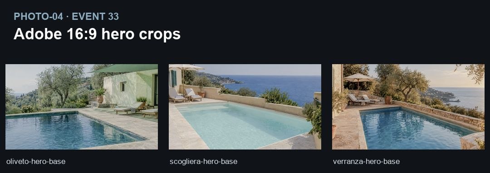

- **Action:** `image_crop_and_resize`
- **Decision:** Create 1920×1080 reframes at quality 7.
- **Parameters:** `{"fit": "reframe", "focus": "subject", "height": 1080, "quality": 7, "width": 1920}`
- **Reasoning:** The crop preserves the three place-first pool compositions.
- **Snapshot:** `trajectory/intermediate/33-adobe-16-9-hero-crops.jpg` — 1080×383 JPEG, 62,828 bytes
- **SHA-256:** `15c99b70aca963788ae1d765eb7838f930eea6da1ba3e2540037468fff39074d`
- **Same bytes as prior step:** `false`

#### Underlying asset snapshots (3)

- [oliveto-hero-base.png](underlying/stage-33-adobe-16-9-hero-crops/001-photo-04-oliveto-hero-crop-oliveto-hero-base-png.png) — asset `PHOTO-04-oliveto-hero-crop`; 1920×1080 PNG; `536023ffe31d92b3079c135dcaf0424a8618127247bed2996da45decb1a6a4b5`
- [scogliera-hero-base.png](underlying/stage-33-adobe-16-9-hero-crops/002-photo-04-scogliera-hero-crop-scogliera-hero-base-png.png) — asset `PHOTO-04-scogliera-hero-crop`; 1920×1080 PNG; `710eabe5755cdec8e801b50f79855bfac933c816ecd9852129fdb6fc3485422c`
- [verranza-hero-base.png](underlying/stage-33-adobe-16-9-hero-crops/003-photo-04-verranza-hero-crop-verranza-hero-base-png.png) — asset `PHOTO-04-verranza-hero-crop`; 1920×1080 PNG; `80ce74b09ff9365912cf69077a87660751515233b14c8e828f74b45b120c58c7`

### Stage 34 — Subject detection fallback reviewed

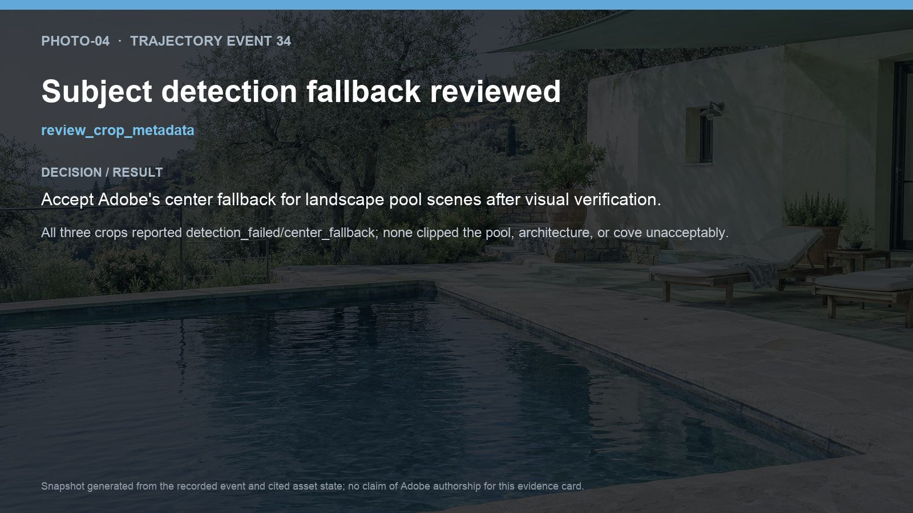

- **Action:** `review_crop_metadata`
- **Decision:** Accept Adobe's center fallback for landscape pool scenes after visual verification.
- **Parameters:** `{}`
- **Reasoning:** All three crops reported detection_failed/center_fallback; none clipped the pool, architecture, or cove unacceptably.
- **Snapshot:** `trajectory/intermediate/34-subject-detection-fallback-reviewed.jpg` — 1600×900 JPEG, 190,678 bytes
- **SHA-256:** `c50d01e68ddf6a101c668f7d7fdbc6135c2ccfc14c95f6c4f2af6b53dd24f347`
- **Same bytes as prior step:** `false`

### Stage 35 — Hero crops visually verified

- **Action:** `visual_quality_review`
- **Decision:** Approve all three crop states for layout use.
- **Parameters:** `{}`
- **Reasoning:** The 16:9 frames retain the intended scene hierarchy and sufficient negative space for the opaque information rail.
- **Snapshot:** `trajectory/intermediate/35-hero-crops-visually-verified.jpg` — 1080×383 JPEG, 63,723 bytes
- **SHA-256:** `02bb4f3fab8aed6b72061a44cdfc3eea7f62c77eae37c18225afe906b2f70e14`
- **Same bytes as prior step:** `false`

### Stage 36 — Booking layout system selected

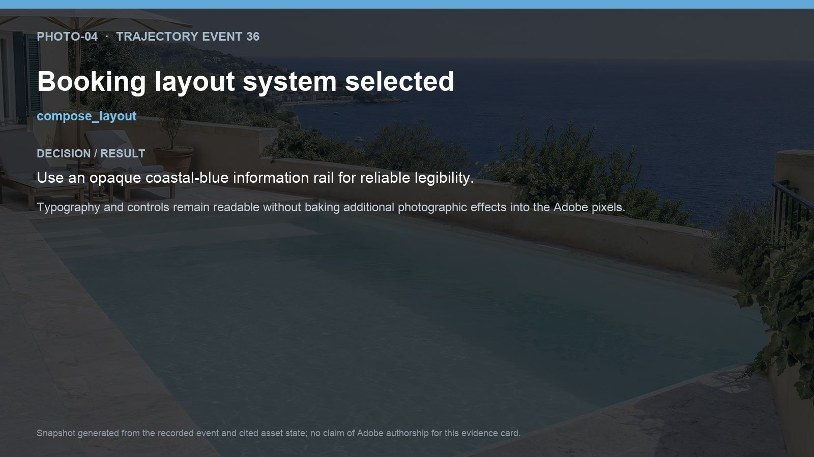

- **Action:** `compose_layout`
- **Decision:** Use an opaque coastal-blue information rail for reliable legibility.
- **Parameters:** `{}`
- **Reasoning:** Typography and controls remain readable without baking additional photographic effects into the Adobe pixels.
- **Snapshot:** `trajectory/intermediate/36-booking-layout-system-selected.jpg` — 1600×900 JPEG, 130,954 bytes
- **SHA-256:** `a8ca09e08dcaa5b37a2e8cf3e59fb9c51227c1c8d9e7aa326f9675230d76f953`
- **Same bytes as prior step:** `false`

### Stage 37 — Booking hero layout assembled

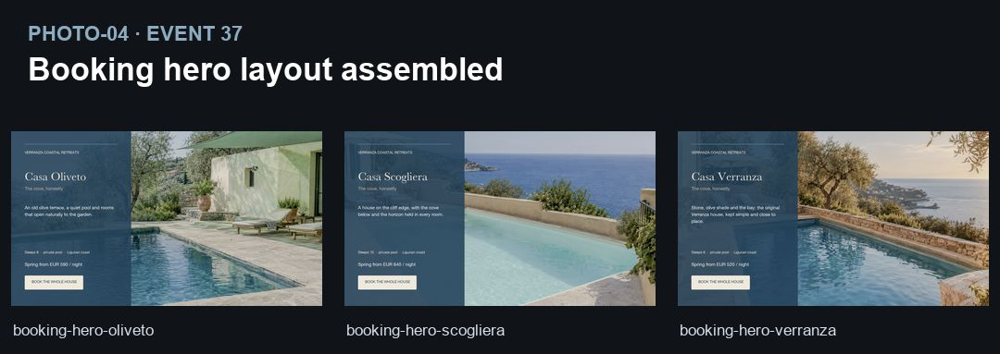

- **Action:** `local_pillow_layout`
- **Decision:** Compose the approved copy and booking treatment over each verified Adobe crop.
- **Parameters:** `{}`
- **Reasoning:** This is a truthful local layout operation; Adobe performed the underlying photographic grade and crop.
- **Snapshot:** `trajectory/intermediate/37-booking-hero-layout-assembled.jpg` — 1080×383 JPEG, 59,382 bytes
- **SHA-256:** `dc8094387d298efc557e99cb8b692bd573fc131df79bbb1c34139351de27966e`
- **Same bytes as prior step:** `false`

### Stage 38 — Three booking heroes exported

- **Action:** `export_png`
- **Decision:** Export all three contracted 1920×1080 PNG heroes.
- **Parameters:** `{}`
- **Reasoning:** Each file was decoded and measured after export.
- **Snapshot:** `trajectory/intermediate/38-three-booking-heroes-exported.jpg` — 1080×383 JPEG, 59,593 bytes
- **SHA-256:** `e9949fb357ff9cf6960f34975905bb88ca2a838e1c414e1b279e38ed7bba195e`
- **Same bytes as prior step:** `false`

### Stage 39 — Brochure cover rendered

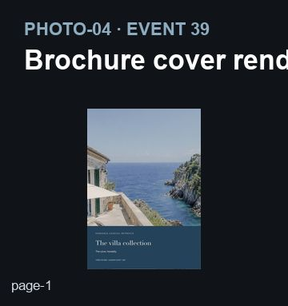

- **Action:** `local_reportlab_layout`
- **Decision:** Use the Scogliera cove view for the collection cover.
- **Parameters:** `{}`
- **Reasoning:** The cover positions the place before the rate and booking information.
- **Snapshot:** `trajectory/intermediate/39-brochure-cover-rendered.jpg` — 360×383 JPEG, 13,879 bytes
- **SHA-256:** `f6f18fe441226c4c370abba648c87d97c6c67bfce4343544884c1eb1fbaaee27`
- **Same bytes as prior step:** `false`

### Stage 40 — Three villa detail pages rendered

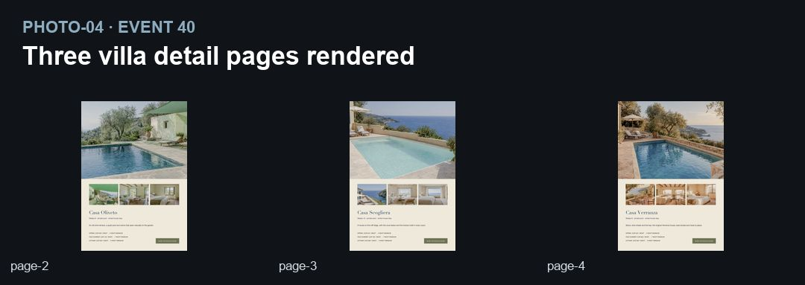

- **Action:** `local_reportlab_layout`
- **Decision:** Present four verified photographs and authoritative rates for each house.
- **Parameters:** `{}`
- **Reasoning:** Oliveto, Scogliera, and Verranza remain distinct while sharing one restrained editorial system.
- **Snapshot:** `trajectory/intermediate/40-three-villa-detail-pages-rendered.jpg` — 1080×383 JPEG, 35,886 bytes
- **SHA-256:** `6e2ab8cc7aaf9edb6408c2f28461a1bb0d6d7dfe8429b2da5b3ff1d051bde467`
- **Same bytes as prior step:** `false`

### Stage 41 — Comparison and booking pages rendered

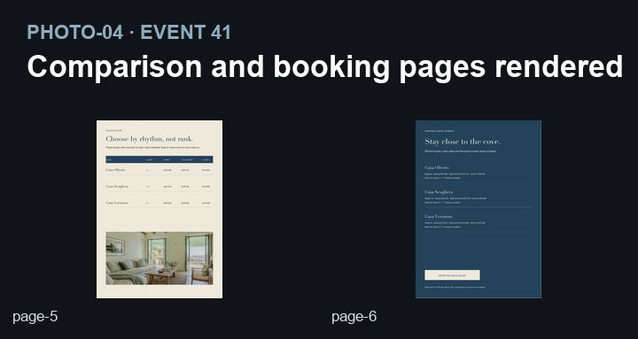

- **Action:** `local_reportlab_layout`
- **Decision:** Provide transparent cross-house comparison and a direct whole-house booking summary.
- **Parameters:** `{}`
- **Reasoning:** The final two pages preserve the reconciled occupancy, seasonal names, rates, and minimum stays.
- **Snapshot:** `trajectory/intermediate/41-comparison-and-booking-pages-rendered.jpg` — 720×383 JPEG, 23,741 bytes
- **SHA-256:** `b19cd4230f8cb7a7cf81332964bb8cecaba4374d2139c52129d5fe781d4a26cd`
- **Same bytes as prior step:** `false`

### Stage 42 — Factual binding verified

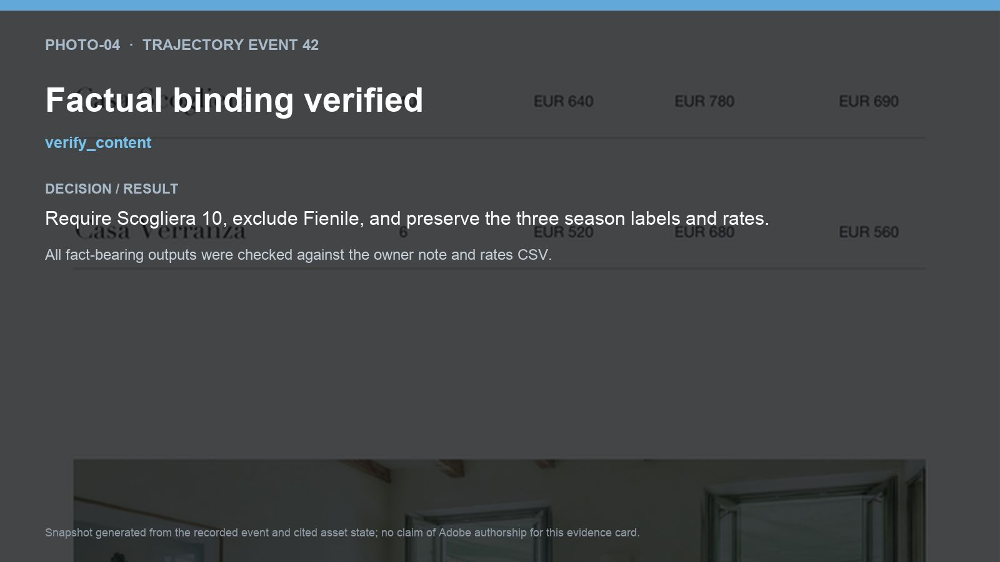

- **Action:** `verify_content`
- **Decision:** Require Scogliera 10, exclude Fienile, and preserve the three season labels and rates.
- **Parameters:** `{}`
- **Reasoning:** All fact-bearing outputs were checked against the owner note and rates CSV.
- **Snapshot:** `trajectory/intermediate/42-factual-binding-verified.jpg` — 1600×900 JPEG, 65,104 bytes
- **SHA-256:** `14693edb3dde2f7c21dbf278876a5fac6adde02f93d872e7440048f2a2ae35e7`
- **Same bytes as prior step:** `false`

### Stage 43 — Technical output verification

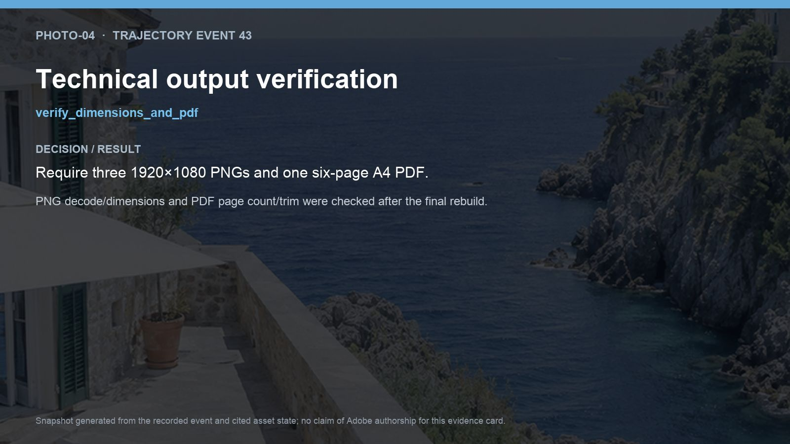

- **Action:** `verify_dimensions_and_pdf`
- **Decision:** Require three 1920×1080 PNGs and one six-page A4 PDF.
- **Parameters:** `{}`
- **Reasoning:** PNG decode/dimensions and PDF page count/trim were checked after the final rebuild.
- **Snapshot:** `trajectory/intermediate/43-technical-output-verification.jpg` — 1600×900 JPEG, 128,616 bytes
- **SHA-256:** `1b1fd2e785fd5bbd9a59cd77530a3b505503e17745d00f42df66176b9c5647fb`
- **Same bytes as prior step:** `false`

### Stage 44 — Final deliverable visual review

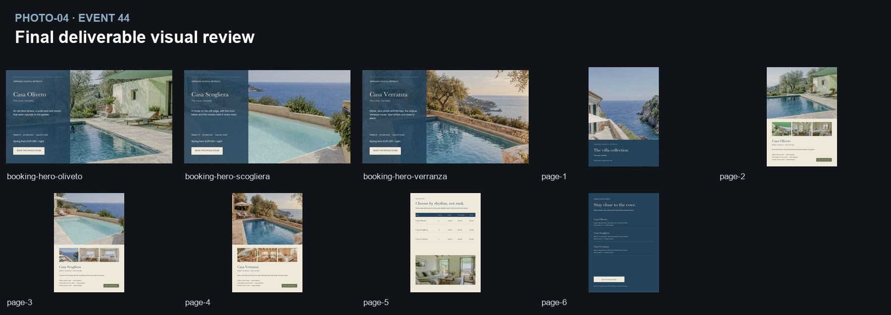

- **Action:** `visual_quality_review`
- **Decision:** Approve all booking heroes and all six brochure pages for release.
- **Parameters:** `{}`
- **Reasoning:** The final renders show no clipped text, broken images, overlapping elements, or unreadable controls.
- **Snapshot:** `trajectory/intermediate/44-final-deliverable-visual-review.jpg` — 1800×638 JPEG, 104,531 bytes
- **SHA-256:** `36c81d0456a498bd13a81709971e3b874e73b148416cc1bd6f7c084ef7104373`
- **Same bytes as prior step:** `false`

### Stage 45 — Release package prepared

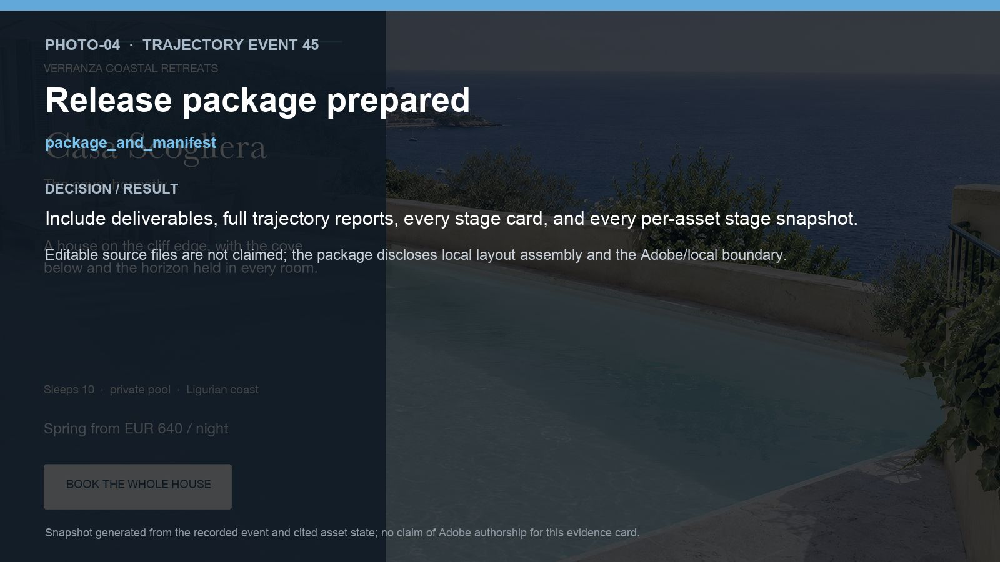

- **Action:** `package_and_manifest`
- **Decision:** Include deliverables, full trajectory reports, every stage card, and every per-asset stage snapshot.
- **Parameters:** `{}`
- **Reasoning:** Editable source files are not claimed; the package discloses local layout assembly and the Adobe/local boundary.
- **Snapshot:** `trajectory/intermediate/45-release-package-prepared.jpg` — 1600×900 JPEG, 122,430 bytes
- **SHA-256:** `013151738c5c91e7a6ff1708e04113b91a8f730ad5f3ff2832bd31fcf5b4532b`
- **Same bytes as prior step:** `false`

## Recorded retries and recovery

- `{"failure": "Adobe rejected the public annotation S3 source domain as untrusted.", "recovery": "Downloaded the canonical public sources and uploaded them to Adobe Creative Cloud in one 22-file ingestion call.", "stage": "source-ingestion-preview", "status": "recovered"}`
- `{"failure": "Legacy fit=contain parameter was rejected by the current crop/resize schema.", "recovery": "Retried proportional width-only preview scaling.", "stage": "preview-downscale", "status": "recovered"}`
- `{"failure": "A single 22-image request returned only the first 10 outputs.", "recovery": "Retained those 10 and processed the unreturned 12 in chunks of 10 and 2.", "stage": "auto-straighten", "status": "recovered"}`
- `{"failure": "Two concurrent 10-image requests returned Adobe transport HTTP 504.", "recovery": "Retried the first 20 images sequentially in four chunks of five; the final two-image chunk had already succeeded.", "stage": "auto-tone", "status": "recovered"}`
- `{"failure": "Sandbox DNS blocked direct resolution of photoshop-api.adobe.io.", "recovery": "Used the approved escalated curl network path and parallel downloads.", "stage": "local-preservation", "status": "recovered"}`
- `{"failure": "Initial sequential download was too slow for 22 full-resolution PNGs.", "recovery": "Canceled the sequential transfer and restarted with curl parallelism capped at eight.", "stage": "local-preservation", "status": "recovered"}`
