# SB3-013-PHO trajectory evidence

**Title:** Argent & Faith — Spring jewellery capsule photography

**Evidence boundary:** Every step below has a decoded local snapshot copied byte-for-byte into this package. The manifest—not this builder—is the source for action, parameter, decision, timestamp, and request-ID claims.

**Status:** production complete; publication verification follows packaging

[Contact sheet](contact-sheet.png) · [Contact sheet report](contact-sheet.html) · [Decision evidence](decision-evidence.html)

## Ordered snapshot trajectory

### Stage 1 — Contract and output register loaded

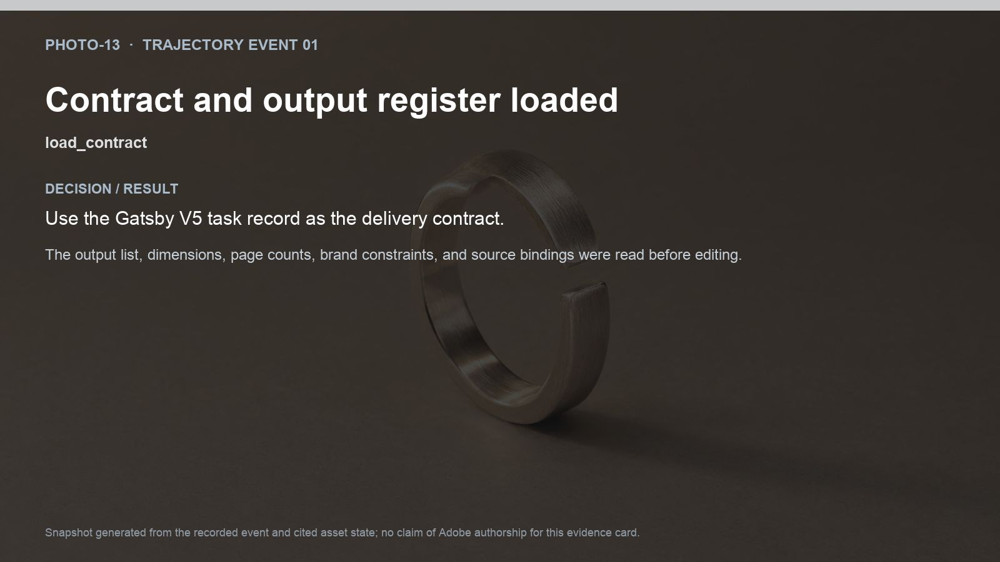

- **Action:** `load_contract`
- **Decision:** Use the Gatsby V5 task record as the delivery contract.
- **Parameters:** `{}`
- **Reasoning:** The output list, dimensions, page counts, brand constraints, and source bindings were read before editing.
- **Snapshot:** `trajectory/intermediate/01-contract-and-output-register-loaded.jpg` — 1600×900 JPEG, 71,746 bytes
- **SHA-256:** `f234dfdebb9aa1883586f41330d36fa212eca6f5974ee23400ee568712d76069`
- **Same bytes as prior step:** `false`

### Stage 2 — Canonical source inventory

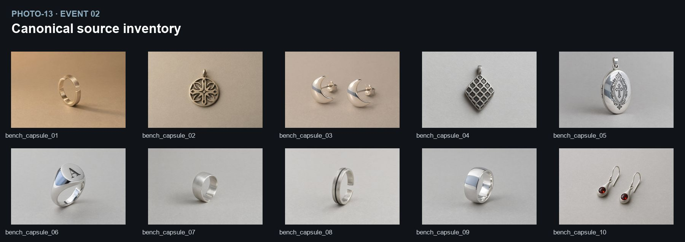

- **Action:** `bind_source_manifest`
- **Decision:** Bind exactly 10 approved photoreal inputs.
- **Parameters:** `{}`
- **Reasoning:** Every listed source matched the authoritative manifest SHA-256 and byte count.
- **Snapshot:** `trajectory/intermediate/02-canonical-source-inventory.jpg` — 1800×638 JPEG, 82,426 bytes
- **SHA-256:** `2ef535423940a334ae1963ecfb3144424143e5b3a65501931c9287894fa87d1b`
- **Same bytes as prior step:** `false`

#### Underlying asset snapshots (10)

- [bench_capsule_01.jpg](underlying/stage-02-canonical-source-inventory/001-urn-aaid-sc-va6c2-50b7523f-3813-4064-9654-891b656e3084-bench-capsule-01-jpg.jpg) — asset `urn:aaid:sc:VA6C2:50b7523f-3813-4064-9654-891b656e3084`; 1600×1067 JPEG; `a410c77ed779c7b972b61578b5a3213e7a130bf88cf03034551ccfa277cb751e`
- [bench_capsule_02.jpg](underlying/stage-02-canonical-source-inventory/002-urn-aaid-sc-va6c2-698cc620-4b60-48db-bef7-025ab38be8f1-bench-capsule-02-jpg.jpg) — asset `urn:aaid:sc:VA6C2:698cc620-4b60-48db-bef7-025ab38be8f1`; 1600×1067 JPEG; `0049b0ebb9bda12bda168b7ff14c34cd65f4fbe675e4b5b94d8fc24ffe8c50c5`
- [bench_capsule_03.jpg](underlying/stage-02-canonical-source-inventory/003-urn-aaid-sc-va6c2-1f7d30af-01b8-47c8-a6cb-cdf789418ae7-bench-capsule-03-jpg.jpg) — asset `urn:aaid:sc:VA6C2:1f7d30af-01b8-47c8-a6cb-cdf789418ae7`; 1600×1067 JPEG; `e0b24163e7aaeec47c15e35f0a3ab7dfcb92ecc79e2b818b49ebf070adf3c876`
- [bench_capsule_04.jpg](underlying/stage-02-canonical-source-inventory/004-urn-aaid-sc-va6c2-e6fd4d59-8093-42da-8725-9b85a28142b1-bench-capsule-04-jpg.jpg) — asset `urn:aaid:sc:VA6C2:e6fd4d59-8093-42da-8725-9b85a28142b1`; 1600×1067 JPEG; `a1b00bce2d70adb7665cf4ff90f8485a11814068e10875f69b668b58beed8c09`
- [bench_capsule_05.jpg](underlying/stage-02-canonical-source-inventory/005-urn-aaid-sc-va6c2-990b1284-f9ef-495b-b030-66eb19ae84db-bench-capsule-05-jpg.jpg) — asset `urn:aaid:sc:VA6C2:990b1284-f9ef-495b-b030-66eb19ae84db`; 1600×1067 JPEG; `4639d8930ad36b0182f486c77eab3a51e761c073b6d194d8a97cd760eb6011cb`
- [bench_capsule_06.jpg](underlying/stage-02-canonical-source-inventory/006-urn-aaid-sc-va6c2-4ff8fc1f-4b5b-4cda-8a3a-8818d4faf31a-bench-capsule-06-jpg.jpg) — asset `urn:aaid:sc:VA6C2:4ff8fc1f-4b5b-4cda-8a3a-8818d4faf31a`; 1600×1067 JPEG; `8c1e33b4d49001d5f5f2d6570ed14f1d8b67739e801a29b58001a2fff6200fa3`
- [bench_capsule_07.jpg](underlying/stage-02-canonical-source-inventory/007-urn-aaid-sc-va6c2-402bbf98-a908-46e9-85bb-73d7255ad6b7-bench-capsule-07-jpg.jpg) — asset `urn:aaid:sc:VA6C2:402bbf98-a908-46e9-85bb-73d7255ad6b7`; 1600×1067 JPEG; `1b44119af544ca5799a07ea6a01290bb01fb70c717d03aae3eef49347bc2a236`
- [bench_capsule_08.jpg](underlying/stage-02-canonical-source-inventory/008-urn-aaid-sc-va6c2-15755ca1-dd5f-476c-85a9-5025f3861e88-bench-capsule-08-jpg.jpg) — asset `urn:aaid:sc:VA6C2:15755ca1-dd5f-476c-85a9-5025f3861e88`; 1600×1067 JPEG; `c7c98cbfc86b5e901f0b43223b6a619ddeb44b8e86907e99fb7eaa5a0d9922a3`
- [bench_capsule_09.jpg](underlying/stage-02-canonical-source-inventory/009-urn-aaid-sc-va6c2-19087171-c518-4d31-82a8-38d12673298e-bench-capsule-09-jpg.jpg) — asset `urn:aaid:sc:VA6C2:19087171-c518-4d31-82a8-38d12673298e`; 1600×1067 JPEG; `f0c13dc56ffcbecba64bec9bc03fd3251136585210fe76e29ccbb224424f8298`
- [bench_capsule_10.jpg](underlying/stage-02-canonical-source-inventory/010-urn-aaid-sc-va6c2-0647f341-b4dc-456f-b100-d1ff827ee5da-bench-capsule-10-jpg.jpg) — asset `urn:aaid:sc:VA6C2:0647f341-b4dc-456f-b100-d1ff827ee5da`; 1600×1067 JPEG; `3dac4b7e23f8d5c6bcdb8e500fcd4ce44c6035f57bf0f9a18175ef8a2e3c5cfb`

### Stage 3 — Inventory rows bound to photographs

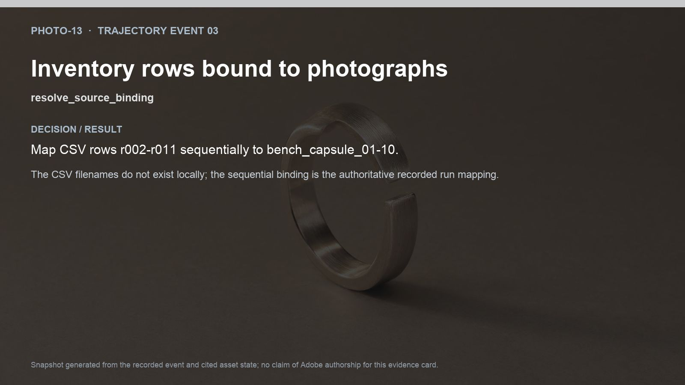

- **Action:** `resolve_source_binding`
- **Decision:** Map CSV rows r002-r011 sequentially to bench_capsule_01-10.
- **Parameters:** `{}`
- **Reasoning:** The CSV filenames do not exist locally; the sequential binding is the authoritative recorded run mapping.
- **Snapshot:** `trajectory/intermediate/03-inventory-rows-bound-to-photographs.jpg` — 1600×900 JPEG, 74,516 bytes
- **SHA-256:** `2ca848af145479a6a2bac3cd75c9d374b6cdfb0ebf7d93ac66629273950e712f`
- **Same bytes as prior step:** `false`

### Stage 4 — House-note constraints fixed

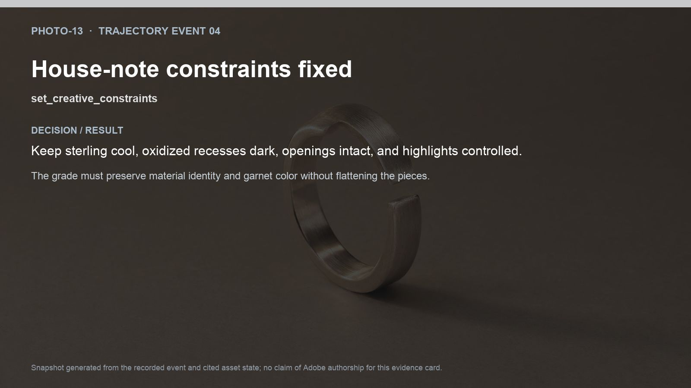

- **Action:** `set_creative_constraints`
- **Decision:** Keep sterling cool, oxidized recesses dark, openings intact, and highlights controlled.
- **Parameters:** `{}`
- **Reasoning:** The grade must preserve material identity and garnet color without flattening the pieces.
- **Snapshot:** `trajectory/intermediate/04-house-note-constraints-fixed.jpg` — 1600×900 JPEG, 72,582 bytes
- **SHA-256:** `8adec2dadf320aa86d761d7f5998f96712dbb696c2b0ab175c88dda89040fd47`
- **Same bytes as prior step:** `false`

### Stage 5 — Negative-space rule fixed

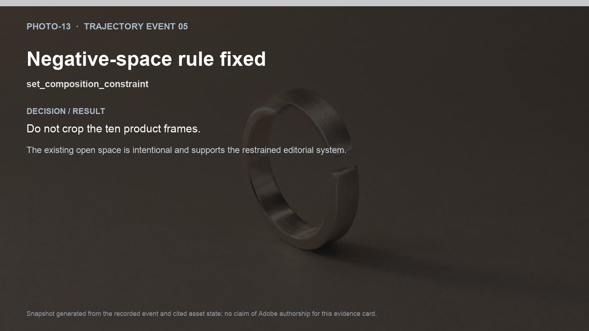

- **Action:** `set_composition_constraint`
- **Decision:** Do not crop the ten product frames.
- **Parameters:** `{}`
- **Reasoning:** The existing open space is intentional and supports the restrained editorial system.
- **Snapshot:** `trajectory/intermediate/05-negative-space-rule-fixed.jpg` — 1600×900 JPEG, 65,147 bytes
- **SHA-256:** `fd0eaaeed53e6b1ec6ec53a50297c0b43fe3dc18c87d6389e7e47b105de40bad`
- **Same bytes as prior step:** `false`

### Stage 6 — Representative preview selected

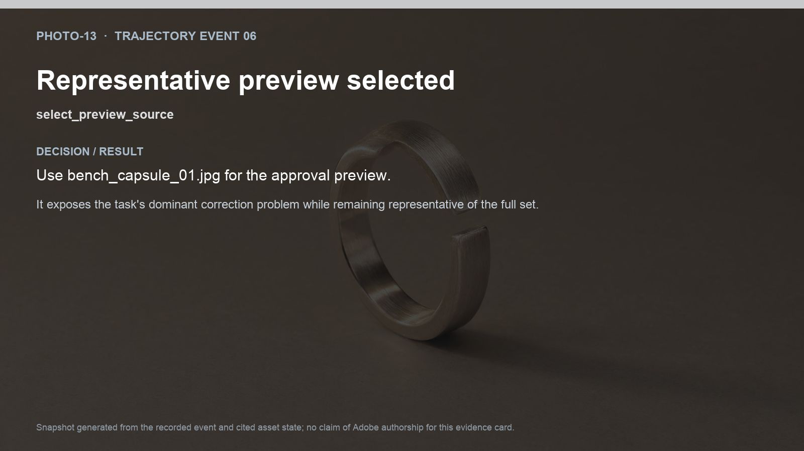

- **Action:** `select_preview_source`
- **Decision:** Use bench_capsule_01.jpg for the approval preview.
- **Parameters:** `{}`
- **Reasoning:** It exposes the task's dominant correction problem while remaining representative of the full set.
- **Snapshot:** `trajectory/intermediate/06-representative-preview-selected.jpg` — 1600×900 JPEG, 70,896 bytes
- **SHA-256:** `a2d796b3d6b35ceb57eab455476a3461bdda04bb57f5cd87354a482cb76b119d`
- **Same bytes as prior step:** `false`

### Stage 7 — Source state diagnosed

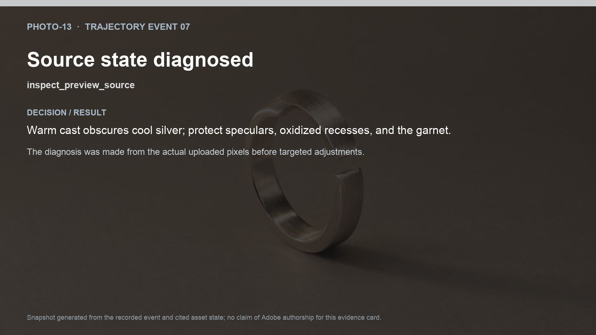

- **Action:** `inspect_preview_source`
- **Decision:** Warm cast obscures cool silver; protect speculars, oxidized recesses, and the garnet.
- **Parameters:** `{}`
- **Reasoning:** The diagnosis was made from the actual uploaded pixels before targeted adjustments.
- **Snapshot:** `trajectory/intermediate/07-source-state-diagnosed.jpg` — 1600×900 JPEG, 70,473 bytes
- **SHA-256:** `74dd9c3cf10635c585af0fc886224ca6c182a5e3f3deae3137910990187caa1e`
- **Same bytes as prior step:** `false`

### Stage 8 — Adobe workflow initialized

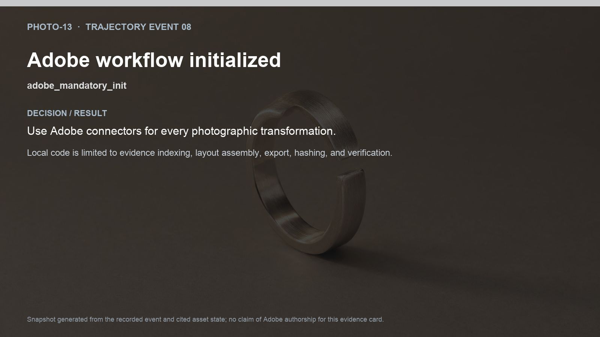

- **Action:** `adobe_mandatory_init`
- **Decision:** Use Adobe connectors for every photographic transformation.
- **Parameters:** `{}`
- **Reasoning:** Local code is limited to evidence indexing, layout assembly, export, hashing, and verification.
- **Snapshot:** `trajectory/intermediate/08-adobe-workflow-initialized.jpg` — 1600×900 JPEG, 68,725 bytes
- **SHA-256:** `1db7628d585438c25f3e133e65a65a33c421558e8a79b4d819b74a3ceb5baf14`
- **Same bytes as prior step:** `false`

### Stage 9 — Runtime preset catalog inspected

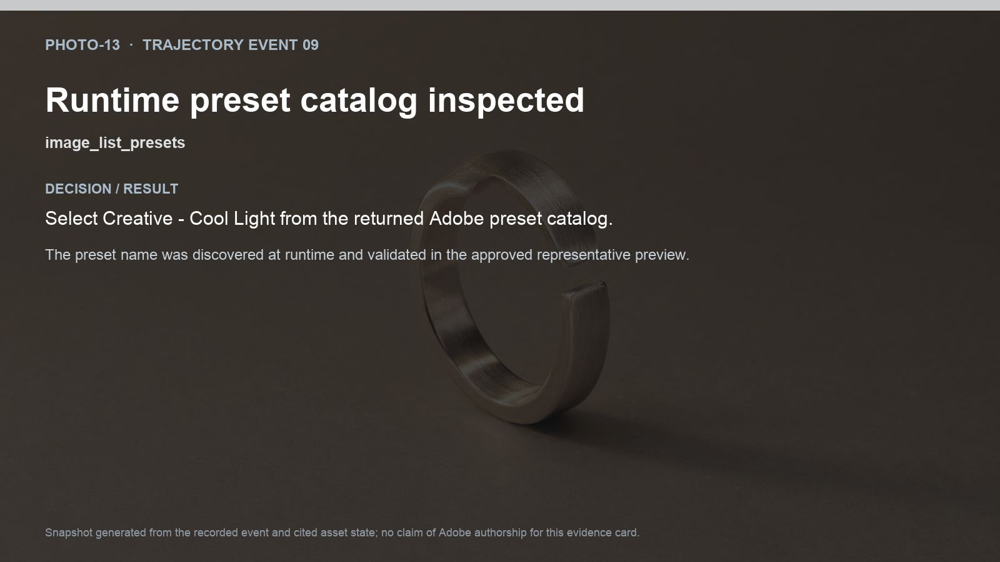

- **Action:** `image_list_presets`
- **Decision:** Select Creative - Cool Light from the returned Adobe preset catalog.
- **Parameters:** `{"presetName": "Creative - Cool Light"}`
- **Reasoning:** The preset name was discovered at runtime and validated in the approved representative preview.
- **Snapshot:** `trajectory/intermediate/09-runtime-preset-catalog-inspected.jpg` — 1600×900 JPEG, 72,572 bytes
- **SHA-256:** `9aa128414f0c874afe8e46c4e28af15caa567f08fe15d00923b04e9a3bbbb84a`
- **Same bytes as prior step:** `false`

### Stage 10 — Sources ingested into Adobe

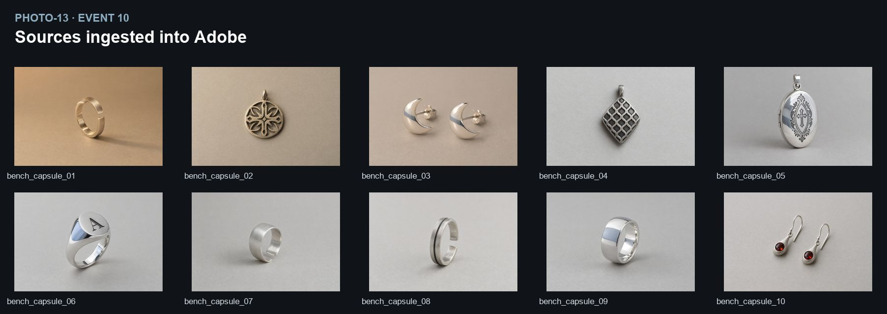

- **Action:** `asset_openai_file_upload`
- **Decision:** Upload all 22 canonical photographs in one connector call, then retain the returned Adobe asset IDs.
- **Parameters:** `{}`
- **Reasoning:** The public S3 host was rejected by Adobe, so verified local copies were uploaded through the connector.
- **Snapshot:** `trajectory/intermediate/10-sources-ingested-into-adobe.jpg` — 1800×638 JPEG, 82,841 bytes
- **SHA-256:** `7b445afd6e751bcef28617c2566b48be27434a4f26912441f340c574c23ffd9c`
- **Same bytes as prior step:** `false`

#### Underlying asset snapshots (10)

- [bench_capsule_01.jpg](underlying/stage-10-sources-ingested-into-adobe/001-urn-aaid-sc-va6c2-50b7523f-3813-4064-9654-891b656e3084-bench-capsule-01-jpg.jpg) — asset `urn:aaid:sc:VA6C2:50b7523f-3813-4064-9654-891b656e3084`; 1600×1067 JPEG; `a410c77ed779c7b972b61578b5a3213e7a130bf88cf03034551ccfa277cb751e`
- [bench_capsule_02.jpg](underlying/stage-10-sources-ingested-into-adobe/002-urn-aaid-sc-va6c2-698cc620-4b60-48db-bef7-025ab38be8f1-bench-capsule-02-jpg.jpg) — asset `urn:aaid:sc:VA6C2:698cc620-4b60-48db-bef7-025ab38be8f1`; 1600×1067 JPEG; `0049b0ebb9bda12bda168b7ff14c34cd65f4fbe675e4b5b94d8fc24ffe8c50c5`
- [bench_capsule_03.jpg](underlying/stage-10-sources-ingested-into-adobe/003-urn-aaid-sc-va6c2-1f7d30af-01b8-47c8-a6cb-cdf789418ae7-bench-capsule-03-jpg.jpg) — asset `urn:aaid:sc:VA6C2:1f7d30af-01b8-47c8-a6cb-cdf789418ae7`; 1600×1067 JPEG; `e0b24163e7aaeec47c15e35f0a3ab7dfcb92ecc79e2b818b49ebf070adf3c876`
- [bench_capsule_04.jpg](underlying/stage-10-sources-ingested-into-adobe/004-urn-aaid-sc-va6c2-e6fd4d59-8093-42da-8725-9b85a28142b1-bench-capsule-04-jpg.jpg) — asset `urn:aaid:sc:VA6C2:e6fd4d59-8093-42da-8725-9b85a28142b1`; 1600×1067 JPEG; `a1b00bce2d70adb7665cf4ff90f8485a11814068e10875f69b668b58beed8c09`
- [bench_capsule_05.jpg](underlying/stage-10-sources-ingested-into-adobe/005-urn-aaid-sc-va6c2-990b1284-f9ef-495b-b030-66eb19ae84db-bench-capsule-05-jpg.jpg) — asset `urn:aaid:sc:VA6C2:990b1284-f9ef-495b-b030-66eb19ae84db`; 1600×1067 JPEG; `4639d8930ad36b0182f486c77eab3a51e761c073b6d194d8a97cd760eb6011cb`
- [bench_capsule_06.jpg](underlying/stage-10-sources-ingested-into-adobe/006-urn-aaid-sc-va6c2-4ff8fc1f-4b5b-4cda-8a3a-8818d4faf31a-bench-capsule-06-jpg.jpg) — asset `urn:aaid:sc:VA6C2:4ff8fc1f-4b5b-4cda-8a3a-8818d4faf31a`; 1600×1067 JPEG; `8c1e33b4d49001d5f5f2d6570ed14f1d8b67739e801a29b58001a2fff6200fa3`
- [bench_capsule_07.jpg](underlying/stage-10-sources-ingested-into-adobe/007-urn-aaid-sc-va6c2-402bbf98-a908-46e9-85bb-73d7255ad6b7-bench-capsule-07-jpg.jpg) — asset `urn:aaid:sc:VA6C2:402bbf98-a908-46e9-85bb-73d7255ad6b7`; 1600×1067 JPEG; `1b44119af544ca5799a07ea6a01290bb01fb70c717d03aae3eef49347bc2a236`
- [bench_capsule_08.jpg](underlying/stage-10-sources-ingested-into-adobe/008-urn-aaid-sc-va6c2-15755ca1-dd5f-476c-85a9-5025f3861e88-bench-capsule-08-jpg.jpg) — asset `urn:aaid:sc:VA6C2:15755ca1-dd5f-476c-85a9-5025f3861e88`; 1600×1067 JPEG; `c7c98cbfc86b5e901f0b43223b6a619ddeb44b8e86907e99fb7eaa5a0d9922a3`
- [bench_capsule_09.jpg](underlying/stage-10-sources-ingested-into-adobe/009-urn-aaid-sc-va6c2-19087171-c518-4d31-82a8-38d12673298e-bench-capsule-09-jpg.jpg) — asset `urn:aaid:sc:VA6C2:19087171-c518-4d31-82a8-38d12673298e`; 1600×1067 JPEG; `f0c13dc56ffcbecba64bec9bc03fd3251136585210fe76e29ccbb224424f8298`
- [bench_capsule_10.jpg](underlying/stage-10-sources-ingested-into-adobe/010-urn-aaid-sc-va6c2-0647f341-b4dc-456f-b100-d1ff827ee5da-bench-capsule-10-jpg.jpg) — asset `urn:aaid:sc:VA6C2:0647f341-b4dc-456f-b100-d1ff827ee5da`; 1600×1067 JPEG; `3dac4b7e23f8d5c6bcdb8e500fcd4ce44c6035f57bf0f9a18175ef8a2e3c5cfb`

### Stage 11 — Preview downscale

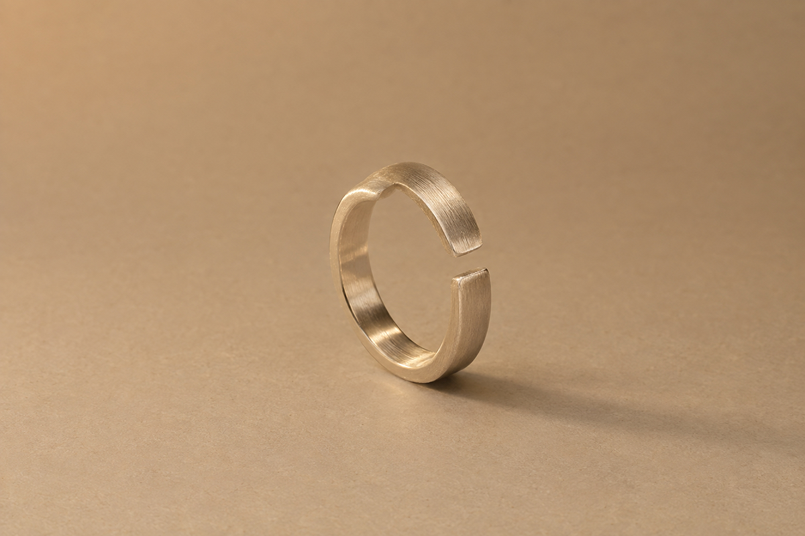

- **Action:** `image_crop_and_resize`
- **Decision:** Downscale proportionally for rapid review without changing aspect ratio.
- **Parameters:** `{}`
- **Reasoning:** The connector output was captured immediately and retained as its own trajectory state.
- **Snapshot:** `trajectory/intermediate/11-preview-downscale.png` — 1200×800 PNG, 1,038,151 bytes
- **SHA-256:** `b74ec56f651becef04e93a0a1f08197d766595fa951e5a2e4cbd9879da022ec6`
- **Same bytes as prior step:** `false`

### Stage 12 — Preview auto-straighten

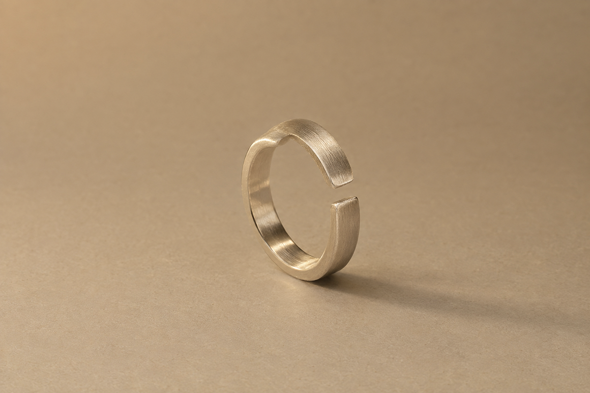

- **Action:** `image_auto_straighten`
- **Decision:** Apply automatic leveling with constrained crop.
- **Parameters:** `{}`
- **Reasoning:** The connector output was captured immediately and retained as its own trajectory state.
- **Snapshot:** `trajectory/intermediate/12-preview-auto-straighten.png` — 1200×800 PNG, 1,109,334 bytes
- **SHA-256:** `3a22529f15a9d97e5cf6d2e83b6f9518ccd9dd504472e3e2d45f45edbaf2c28f`
- **Same bytes as prior step:** `false`

### Stage 13 — Preview auto-tone

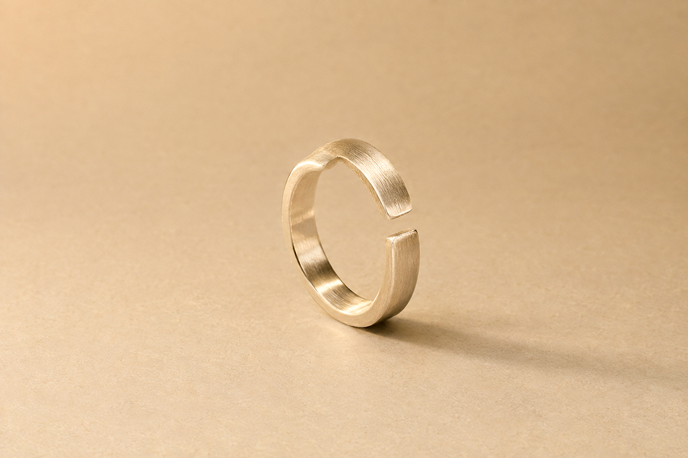

- **Action:** `image_apply_auto_tone`
- **Decision:** Establish a neutral tonal baseline before the creative grade.
- **Parameters:** `{}`
- **Reasoning:** The connector output was captured immediately and retained as its own trajectory state.
- **Snapshot:** `trajectory/intermediate/13-preview-auto-tone.png` — 1200×800 PNG, 1,280,126 bytes
- **SHA-256:** `e71e8f1c397ddcc79dc5e144d366e5438181644bbef0e20493f7b642a26c9f93`
- **Same bytes as prior step:** `false`

### Stage 14 — Preview task-specific look

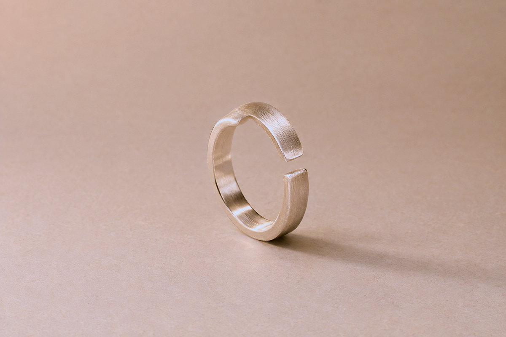

- **Action:** `image_apply_adjustments`
- **Decision:** Apply the proposed task-specific color and luminance correction.
- **Parameters:** `{}`
- **Reasoning:** The connector output was captured immediately and retained as its own trajectory state.
- **Snapshot:** `trajectory/intermediate/14-preview-task-specific-look.png` — 1200×800 PNG, 1,219,133 bytes
- **SHA-256:** `b288f7c7a05767378c68d18101f728203bfee87e7f611f2664534a3bf8341e39`
- **Same bytes as prior step:** `false`

### Stage 15 — Preview Adobe preset

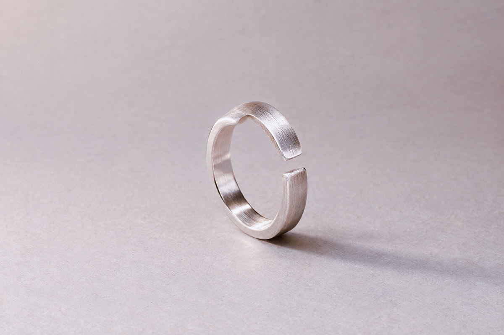

- **Action:** `image_apply_preset`
- **Decision:** Apply the catalog preset Creative - Cool Light.
- **Parameters:** `{}`
- **Reasoning:** The connector output was captured immediately and retained as its own trajectory state.
- **Snapshot:** `trajectory/intermediate/15-preview-adobe-preset.png` — 1200×800 PNG, 1,258,194 bytes
- **SHA-256:** `5818e68c4c9f0c94063f4ad321582b7df2449581db1e1e7e6799d9ab7baacdb5`
- **Same bytes as prior step:** `false`

### Stage 16 — Preview highlight/shadow fine-tune

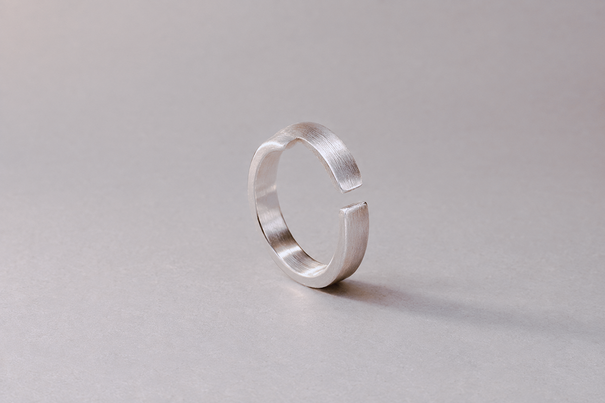

- **Action:** `image_apply_adjustments`
- **Decision:** Recover highlights and open dark regions with highlights -60 and darks +40.
- **Parameters:** `{}`
- **Reasoning:** The connector output was captured immediately and retained as its own trajectory state.
- **Snapshot:** `trajectory/intermediate/16-preview-highlight-shadow-fine-tune.png` — 1200×800 PNG, 1,035,760 bytes
- **SHA-256:** `2864f1d3ff6f75309988eeaea1dd9b17dd3c522aaadac3995e8fb3085df10db8`
- **Same bytes as prior step:** `false`

### Stage 17 — Preview visually verified

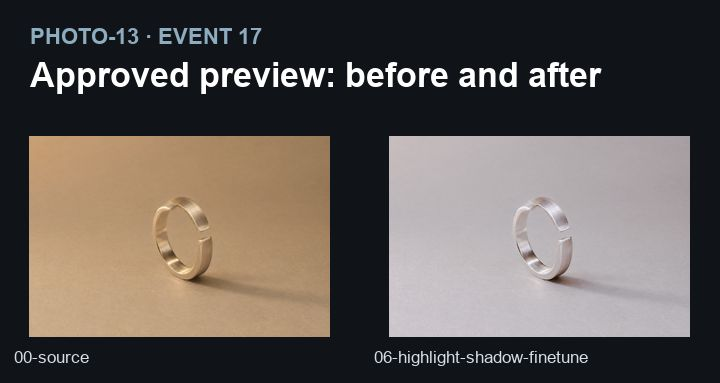

- **Action:** `visual_compare`
- **Decision:** Accept the proposed grade for full-batch application.
- **Parameters:** `{}`
- **Reasoning:** The after state improves tonal balance while retaining subject identity, texture, and detail.
- **Snapshot:** `trajectory/intermediate/17-preview-visually-verified.jpg` — 720×383 JPEG, 23,684 bytes
- **SHA-256:** `3e838071dd68a0feecd08899c1be1aff774021f1163632cd801845e8c27aa761`
- **Same bytes as prior step:** `false`

### Stage 18 — Explicit user approval captured

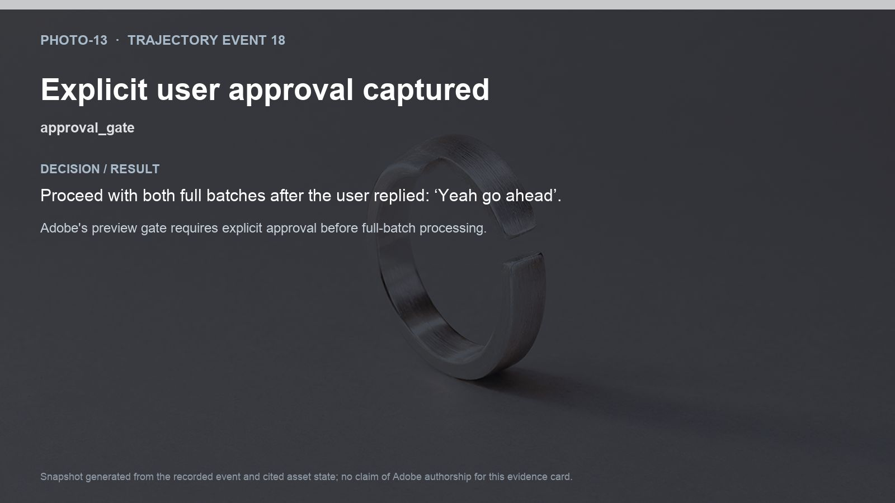

- **Action:** `approval_gate`
- **Decision:** Proceed with both full batches after the user replied: ‘Yeah go ahead’.
- **Parameters:** `{"approval": "Yeah go ahead"}`
- **Reasoning:** Adobe's preview gate requires explicit approval before full-batch processing.
- **Snapshot:** `trajectory/intermediate/18-explicit-user-approval-captured.jpg` — 1600×900 JPEG, 66,309 bytes
- **SHA-256:** `0fc72e293f814026aa4c643a98b7a71f915fd6d4567ec8d6331e69d5986ffe8d`
- **Same bytes as prior step:** `false`

### Stage 19 — Full batch input state

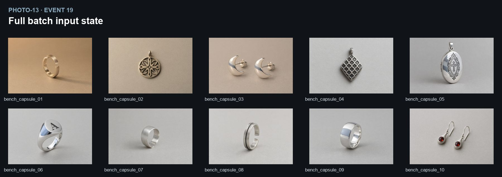

- **Action:** `prepare_full_batch`
- **Decision:** Process all 10 task photographs.
- **Parameters:** `{}`
- **Reasoning:** The complete task inventory—not only the representative preview—entered the production run.
- **Snapshot:** `trajectory/intermediate/19-full-batch-input-state.jpg` — 1800×638 JPEG, 80,949 bytes
- **SHA-256:** `59d51cc41ebc59d07114db7b4451ebe5af5557bfa2e7798e40faa057cd3d385e`
- **Same bytes as prior step:** `false`

#### Underlying asset snapshots (10)

- [bench_capsule_01.jpg](underlying/stage-19-full-batch-input-state/001-urn-aaid-sc-va6c2-50b7523f-3813-4064-9654-891b656e3084-bench-capsule-01-jpg.jpg) — asset `urn:aaid:sc:VA6C2:50b7523f-3813-4064-9654-891b656e3084`; 1600×1067 JPEG; `a410c77ed779c7b972b61578b5a3213e7a130bf88cf03034551ccfa277cb751e`
- [bench_capsule_02.jpg](underlying/stage-19-full-batch-input-state/002-urn-aaid-sc-va6c2-698cc620-4b60-48db-bef7-025ab38be8f1-bench-capsule-02-jpg.jpg) — asset `urn:aaid:sc:VA6C2:698cc620-4b60-48db-bef7-025ab38be8f1`; 1600×1067 JPEG; `0049b0ebb9bda12bda168b7ff14c34cd65f4fbe675e4b5b94d8fc24ffe8c50c5`
- [bench_capsule_03.jpg](underlying/stage-19-full-batch-input-state/003-urn-aaid-sc-va6c2-1f7d30af-01b8-47c8-a6cb-cdf789418ae7-bench-capsule-03-jpg.jpg) — asset `urn:aaid:sc:VA6C2:1f7d30af-01b8-47c8-a6cb-cdf789418ae7`; 1600×1067 JPEG; `e0b24163e7aaeec47c15e35f0a3ab7dfcb92ecc79e2b818b49ebf070adf3c876`
- [bench_capsule_04.jpg](underlying/stage-19-full-batch-input-state/004-urn-aaid-sc-va6c2-e6fd4d59-8093-42da-8725-9b85a28142b1-bench-capsule-04-jpg.jpg) — asset `urn:aaid:sc:VA6C2:e6fd4d59-8093-42da-8725-9b85a28142b1`; 1600×1067 JPEG; `a1b00bce2d70adb7665cf4ff90f8485a11814068e10875f69b668b58beed8c09`
- [bench_capsule_05.jpg](underlying/stage-19-full-batch-input-state/005-urn-aaid-sc-va6c2-990b1284-f9ef-495b-b030-66eb19ae84db-bench-capsule-05-jpg.jpg) — asset `urn:aaid:sc:VA6C2:990b1284-f9ef-495b-b030-66eb19ae84db`; 1600×1067 JPEG; `4639d8930ad36b0182f486c77eab3a51e761c073b6d194d8a97cd760eb6011cb`
- [bench_capsule_06.jpg](underlying/stage-19-full-batch-input-state/006-urn-aaid-sc-va6c2-4ff8fc1f-4b5b-4cda-8a3a-8818d4faf31a-bench-capsule-06-jpg.jpg) — asset `urn:aaid:sc:VA6C2:4ff8fc1f-4b5b-4cda-8a3a-8818d4faf31a`; 1600×1067 JPEG; `8c1e33b4d49001d5f5f2d6570ed14f1d8b67739e801a29b58001a2fff6200fa3`
- [bench_capsule_07.jpg](underlying/stage-19-full-batch-input-state/007-urn-aaid-sc-va6c2-402bbf98-a908-46e9-85bb-73d7255ad6b7-bench-capsule-07-jpg.jpg) — asset `urn:aaid:sc:VA6C2:402bbf98-a908-46e9-85bb-73d7255ad6b7`; 1600×1067 JPEG; `1b44119af544ca5799a07ea6a01290bb01fb70c717d03aae3eef49347bc2a236`
- [bench_capsule_08.jpg](underlying/stage-19-full-batch-input-state/008-urn-aaid-sc-va6c2-15755ca1-dd5f-476c-85a9-5025f3861e88-bench-capsule-08-jpg.jpg) — asset `urn:aaid:sc:VA6C2:15755ca1-dd5f-476c-85a9-5025f3861e88`; 1600×1067 JPEG; `c7c98cbfc86b5e901f0b43223b6a619ddeb44b8e86907e99fb7eaa5a0d9922a3`
- [bench_capsule_09.jpg](underlying/stage-19-full-batch-input-state/009-urn-aaid-sc-va6c2-19087171-c518-4d31-82a8-38d12673298e-bench-capsule-09-jpg.jpg) — asset `urn:aaid:sc:VA6C2:19087171-c518-4d31-82a8-38d12673298e`; 1600×1067 JPEG; `f0c13dc56ffcbecba64bec9bc03fd3251136585210fe76e29ccbb224424f8298`
- [bench_capsule_10.jpg](underlying/stage-19-full-batch-input-state/010-urn-aaid-sc-va6c2-0647f341-b4dc-456f-b100-d1ff827ee5da-bench-capsule-10-jpg.jpg) — asset `urn:aaid:sc:VA6C2:0647f341-b4dc-456f-b100-d1ff827ee5da`; 1600×1067 JPEG; `3dac4b7e23f8d5c6bcdb8e500fcd4ce44c6035f57bf0f9a18175ef8a2e3c5cfb`

### Stage 20 — Initial batch truncation observed

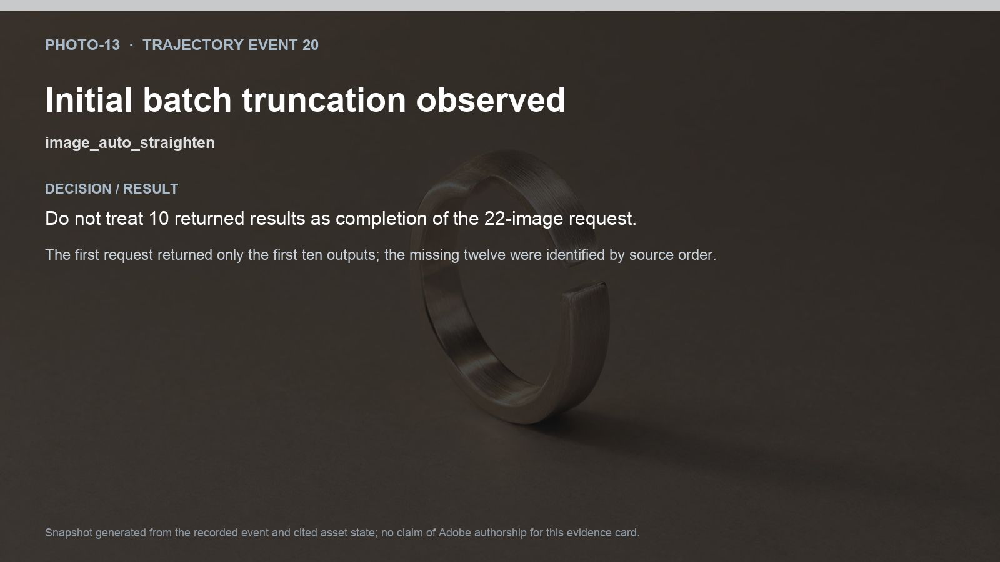

- **Action:** `image_auto_straighten`
- **Decision:** Do not treat 10 returned results as completion of the 22-image request.
- **Parameters:** `{}`
- **Reasoning:** The first request returned only the first ten outputs; the missing twelve were identified by source order.
- **Snapshot:** `trajectory/intermediate/20-initial-batch-truncation-observed.jpg` — 1600×900 JPEG, 72,372 bytes
- **SHA-256:** `15285c859f66080cad1cf7c357d846fe302a4ef60edd71f89732ad69ae057c84`
- **Same bytes as prior step:** `false`

### Stage 21 — Straighten retry chunking

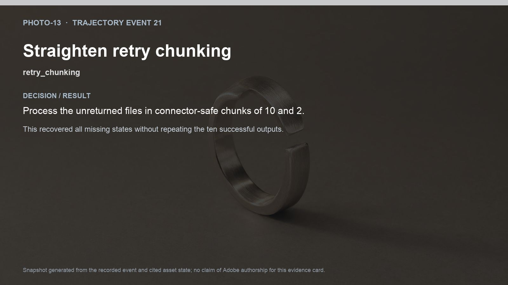

- **Action:** `retry_chunking`
- **Decision:** Process the unreturned files in connector-safe chunks of 10 and 2.
- **Parameters:** `{"chunks": [10, 2]}`
- **Reasoning:** This recovered all missing states without repeating the ten successful outputs.
- **Snapshot:** `trajectory/intermediate/21-straighten-retry-chunking.jpg` — 1600×900 JPEG, 65,986 bytes
- **SHA-256:** `b977686a2a5e3db3d5fcc22438d6acf36a3f34ce9a9d8370422a9e50774ab0cb`
- **Same bytes as prior step:** `false`

### Stage 22 — Full batch straightened

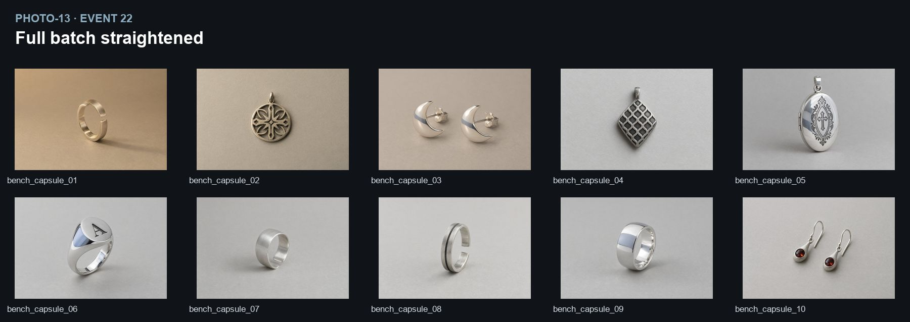

- **Action:** `image_auto_straighten`
- **Decision:** All 10 task files have a captured straightened state.
- **Parameters:** `{"constrainCrop": true, "uprightMode": "auto"}`
- **Reasoning:** Each individual output is linked beneath this derived contact sheet.
- **Snapshot:** `trajectory/intermediate/22-full-batch-straightened.jpg` — 1800×638 JPEG, 81,357 bytes
- **SHA-256:** `6a1300bcda3ce5121a09b938fb97106d532d0e0d4891483dc078133db83bb65a`
- **Same bytes as prior step:** `false`

#### Underlying asset snapshots (10)

- [bench_capsule_01.png](underlying/stage-22-full-batch-straightened/001-photo-13-bench-capsule-01-straighten-bench-capsule-01-png.jpg) — asset `PHOTO-13-bench_capsule_01-straighten`; 1600×1067 JPEG; `49e13a8793a979ab5c81e79c6d04383f24112317113eea943e6d70fa3c7e1a53`
- [bench_capsule_02.png](underlying/stage-22-full-batch-straightened/002-photo-13-bench-capsule-02-straighten-bench-capsule-02-png.jpg) — asset `PHOTO-13-bench_capsule_02-straighten`; 1600×1067 JPEG; `6ad8bbb0933cce51fa2513000d50b2bfc03e69a51c4999db5637774100ae451c`
- [bench_capsule_03.png](underlying/stage-22-full-batch-straightened/003-photo-13-bench-capsule-03-straighten-bench-capsule-03-png.jpg) — asset `PHOTO-13-bench_capsule_03-straighten`; 1600×1067 JPEG; `20059afece4c66dedc8feb37708754496b8e3a35e28fc499e161d6a410503006`
- [bench_capsule_04.png](underlying/stage-22-full-batch-straightened/004-photo-13-bench-capsule-04-straighten-bench-capsule-04-png.jpg) — asset `PHOTO-13-bench_capsule_04-straighten`; 1600×1067 JPEG; `51e6b03195d817bbc5c0e252110176ad34cec89e0c69de09a1c9f036f99caf6a`
- [bench_capsule_05.png](underlying/stage-22-full-batch-straightened/005-photo-13-bench-capsule-05-straighten-bench-capsule-05-png.jpg) — asset `PHOTO-13-bench_capsule_05-straighten`; 1600×1067 JPEG; `676edac1a79eaf39141e7549f273863306e8d1d5155e5e751f7c29154e83bc2a`
- [bench_capsule_06.png](underlying/stage-22-full-batch-straightened/006-photo-13-bench-capsule-06-straighten-bench-capsule-06-png.jpg) — asset `PHOTO-13-bench_capsule_06-straighten`; 1600×1067 JPEG; `9d3107547ef1aa8f501b83c3e6fa901dff1762ca11bade4534a25aeacf48d17a`
- [bench_capsule_07.png](underlying/stage-22-full-batch-straightened/007-photo-13-bench-capsule-07-straighten-bench-capsule-07-png.jpg) — asset `PHOTO-13-bench_capsule_07-straighten`; 1600×1067 JPEG; `5065e8c44e66053abd49f7952dafa098aef6e73fbb92aa1ac6990c89cc60319a`
- [bench_capsule_08.png](underlying/stage-22-full-batch-straightened/008-photo-13-bench-capsule-08-straighten-bench-capsule-08-png.jpg) — asset `PHOTO-13-bench_capsule_08-straighten`; 1600×1067 JPEG; `4899edfcf778a94a386d8d41ff2de30373438be635892f352229e49fe6a3810b`
- [bench_capsule_09.png](underlying/stage-22-full-batch-straightened/009-photo-13-bench-capsule-09-straighten-bench-capsule-09-png.jpg) — asset `PHOTO-13-bench_capsule_09-straighten`; 1600×1067 JPEG; `69887cd927b1931cbe868be01c4240ebb2a15fb591f7a8818bf204a21ec65e29`
- [bench_capsule_10.png](underlying/stage-22-full-batch-straightened/010-photo-13-bench-capsule-10-straighten-bench-capsule-10-png.jpg) — asset `PHOTO-13-bench_capsule_10-straighten`; 1600×1067 JPEG; `df3f7f0b9534dc9dfe59148e5b07b1e7bc8bce5b278578743b1fe62471bb87ba`

### Stage 23 — Local download DNS block

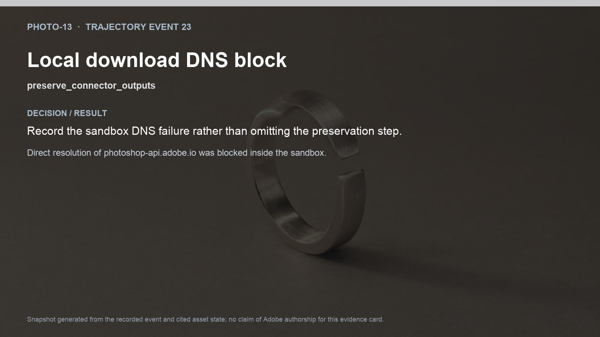

- **Action:** `preserve_connector_outputs`
- **Decision:** Record the sandbox DNS failure rather than omitting the preservation step.
- **Parameters:** `{}`
- **Reasoning:** Direct resolution of photoshop-api.adobe.io was blocked inside the sandbox.
- **Snapshot:** `trajectory/intermediate/23-local-download-dns-block.jpg` — 1600×900 JPEG, 69,209 bytes
- **SHA-256:** `c44c90a4a2013416540767cf5aec0f7ddc3202bbe4ad1dae62d781c36b1951fe`
- **Same bytes as prior step:** `false`

### Stage 24 — Parallel preservation recovery

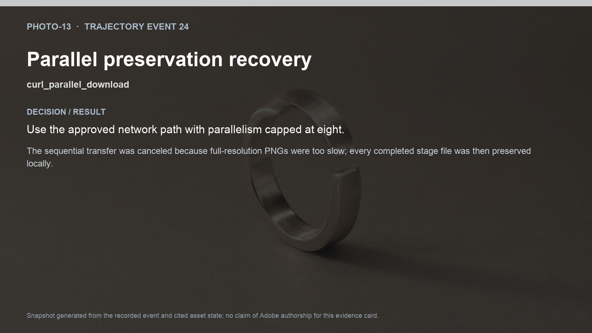

- **Action:** `curl_parallel_download`
- **Decision:** Use the approved network path with parallelism capped at eight.
- **Parameters:** `{"parallel_max": 8}`
- **Reasoning:** The sequential transfer was canceled because full-resolution PNGs were too slow; every completed stage file was then preserved locally.
- **Snapshot:** `trajectory/intermediate/24-parallel-preservation-recovery.jpg` — 1600×900 JPEG, 73,499 bytes
- **SHA-256:** `db6033ff1cb6bf2a8f743535b7744f02d68d423c8baeb4fd45f2eda6ac99b505`
- **Same bytes as prior step:** `false`

### Stage 25 — Concurrent auto-tone timeout

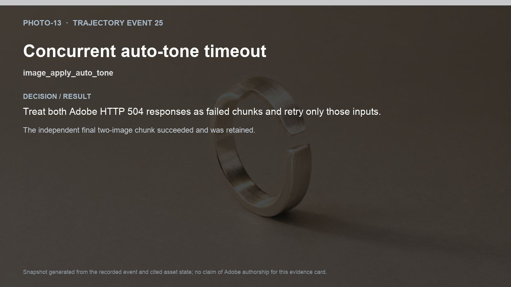

- **Action:** `image_apply_auto_tone`
- **Decision:** Treat both Adobe HTTP 504 responses as failed chunks and retry only those inputs.
- **Parameters:** `{}`
- **Reasoning:** The independent final two-image chunk succeeded and was retained.
- **Snapshot:** `trajectory/intermediate/25-concurrent-auto-tone-timeout.jpg` — 1600×900 JPEG, 71,160 bytes
- **SHA-256:** `f91e518498fe9f4441fdfe05bd99e9f2f7567bf1b5a34a0795b56469645f62c8`
- **Same bytes as prior step:** `false`

### Stage 26 — Auto-tone recovery chunking

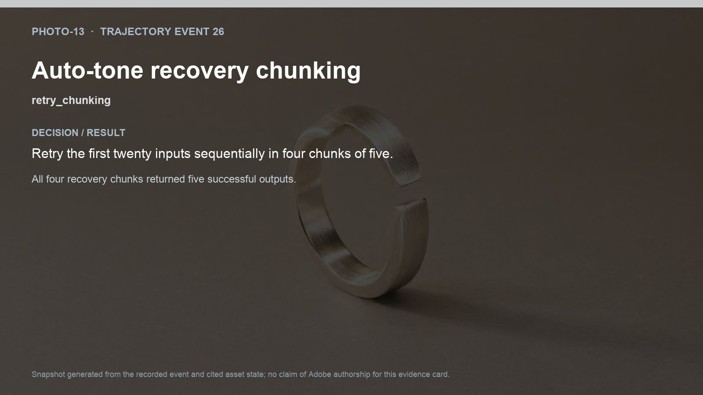

- **Action:** `retry_chunking`
- **Decision:** Retry the first twenty inputs sequentially in four chunks of five.
- **Parameters:** `{"chunks": [5, 5, 5, 5, 2]}`
- **Reasoning:** All four recovery chunks returned five successful outputs.
- **Snapshot:** `trajectory/intermediate/26-auto-tone-recovery-chunking.jpg` — 1600×900 JPEG, 66,137 bytes
- **SHA-256:** `a5e4f1e6993abb01a846a13d1f81b5537c4546c027e06cf7108d40cabd2af952`
- **Same bytes as prior step:** `false`

### Stage 27 — Full batch auto-tone complete

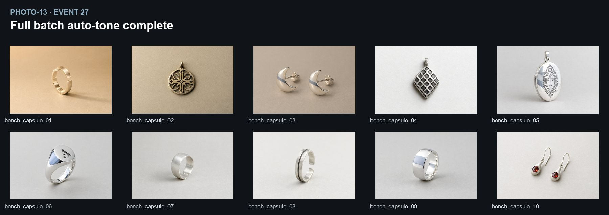

- **Action:** `image_apply_auto_tone`
- **Decision:** All 10 task files have a captured auto-tone state.
- **Parameters:** `{}`
- **Reasoning:** The neutral baseline is preserved separately from the subsequent creative treatment.
- **Snapshot:** `trajectory/intermediate/27-full-batch-auto-tone-complete.jpg` — 1800×638 JPEG, 84,382 bytes
- **SHA-256:** `5b2ec60ae54831ac15e938d966f91559d03973331ff7de31b5acd084b7c9bc8b`
- **Same bytes as prior step:** `false`

#### Underlying asset snapshots (10)

- [bench_capsule_01.png](underlying/stage-27-full-batch-auto-tone-complete/001-photo-13-bench-capsule-01-auto-tone-bench-capsule-01-png.jpg) — asset `PHOTO-13-bench_capsule_01-auto_tone`; 1600×1067 JPEG; `6b6325fa8af549e67971926505b0a517c4e1af138ef61d218dff856d41656a6f`
- [bench_capsule_02.png](underlying/stage-27-full-batch-auto-tone-complete/002-photo-13-bench-capsule-02-auto-tone-bench-capsule-02-png.jpg) — asset `PHOTO-13-bench_capsule_02-auto_tone`; 1600×1067 JPEG; `6d341bc2e19e28ea1fbbd94dee342e3ab7c027a484a989392e35ef7f70ea3b6f`
- [bench_capsule_03.png](underlying/stage-27-full-batch-auto-tone-complete/003-photo-13-bench-capsule-03-auto-tone-bench-capsule-03-png.jpg) — asset `PHOTO-13-bench_capsule_03-auto_tone`; 1600×1067 JPEG; `57b99f2fee519148c0965d90b8df2c1566239a9ec6dc0718108747c7dca37bb7`
- [bench_capsule_04.png](underlying/stage-27-full-batch-auto-tone-complete/004-photo-13-bench-capsule-04-auto-tone-bench-capsule-04-png.jpg) — asset `PHOTO-13-bench_capsule_04-auto_tone`; 1600×1067 JPEG; `206a890116514f41298776ee9c9f0b1a2ab5811078b7580b8eb1db9d9d903b7b`
- [bench_capsule_05.png](underlying/stage-27-full-batch-auto-tone-complete/005-photo-13-bench-capsule-05-auto-tone-bench-capsule-05-png.jpg) — asset `PHOTO-13-bench_capsule_05-auto_tone`; 1600×1067 JPEG; `9bf1c4fac21d2d5861c56aa2594b9db3d24051f00e43174033d53b91f5666a2b`
- [bench_capsule_06.png](underlying/stage-27-full-batch-auto-tone-complete/006-photo-13-bench-capsule-06-auto-tone-bench-capsule-06-png.jpg) — asset `PHOTO-13-bench_capsule_06-auto_tone`; 1600×1067 JPEG; `7955c0997547ca4ca88eca44c77f524a7e4b0312ec4be8b12f462a90564c2a1e`
- [bench_capsule_07.png](underlying/stage-27-full-batch-auto-tone-complete/007-photo-13-bench-capsule-07-auto-tone-bench-capsule-07-png.jpg) — asset `PHOTO-13-bench_capsule_07-auto_tone`; 1600×1067 JPEG; `b6adc7fbbf5c31938fd6e0fbecad5ac8b207ec495afd107ef8d841af383eee40`
- [bench_capsule_08.png](underlying/stage-27-full-batch-auto-tone-complete/008-photo-13-bench-capsule-08-auto-tone-bench-capsule-08-png.jpg) — asset `PHOTO-13-bench_capsule_08-auto_tone`; 1600×1067 JPEG; `efab0fc7b5afde630be098e234551b77e5e6d7d9cc6079a87a025f26d2b85620`
- [bench_capsule_09.png](underlying/stage-27-full-batch-auto-tone-complete/009-photo-13-bench-capsule-09-auto-tone-bench-capsule-09-png.jpg) — asset `PHOTO-13-bench_capsule_09-auto_tone`; 1600×1067 JPEG; `d39814afc147bb238cee1938abb7b944ec70c148f4a79d93066239ea36337d9e`
- [bench_capsule_10.png](underlying/stage-27-full-batch-auto-tone-complete/010-photo-13-bench-capsule-10-auto-tone-bench-capsule-10-png.jpg) — asset `PHOTO-13-bench_capsule_10-auto_tone`; 1600×1067 JPEG; `e1e7f9d53e361dfdda41da034c4f3be16b3d4678de4739612526312970bcd583`

### Stage 28 — Approved look applied

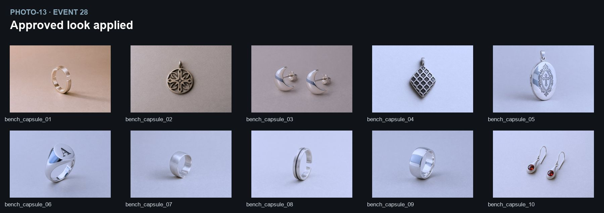

- **Action:** `image_apply_adjustments`
- **Decision:** Apply the approved PHOTO-13 look parameters to every task image.
- **Parameters:** `{"tempA": 18, "tempB": -123, "tempLuminance": 45, "vibrance": 10}`
- **Reasoning:** Inputs were visually inspected immediately before the connector adjustment calls.
- **Snapshot:** `trajectory/intermediate/28-approved-look-applied.jpg` — 1800×638 JPEG, 80,930 bytes
- **SHA-256:** `d517f91704c884605e51d7abef7eb98f2a29243788f8c94b3e00411825ff5b39`
- **Same bytes as prior step:** `false`

#### Underlying asset snapshots (10)

- [bench_capsule_01.png](underlying/stage-28-approved-look-applied/001-photo-13-bench-capsule-01-look-bench-capsule-01-png.jpg) — asset `PHOTO-13-bench_capsule_01-look`; 1600×1067 JPEG; `94a3dcc34093bcde9304f005b56d8f23dc3db932a5a08fad5ca423d2e2414769`
- [bench_capsule_02.png](underlying/stage-28-approved-look-applied/002-photo-13-bench-capsule-02-look-bench-capsule-02-png.jpg) — asset `PHOTO-13-bench_capsule_02-look`; 1600×1067 JPEG; `ed8849a653df8d2d0ad156cb1214a94237b805cdcd0ffba4944a937f1e3533ba`
- [bench_capsule_03.png](underlying/stage-28-approved-look-applied/003-photo-13-bench-capsule-03-look-bench-capsule-03-png.jpg) — asset `PHOTO-13-bench_capsule_03-look`; 1600×1067 JPEG; `43bd25903bd47bb386172f1b5a67e80f5961e17764c355b896dfaba48a3c8764`
- [bench_capsule_04.png](underlying/stage-28-approved-look-applied/004-photo-13-bench-capsule-04-look-bench-capsule-04-png.jpg) — asset `PHOTO-13-bench_capsule_04-look`; 1600×1067 JPEG; `1b0a5ceefe8859b096e6b06aa0ad87d582b505bedda4c46a64e5a93952dfc305`
- [bench_capsule_05.png](underlying/stage-28-approved-look-applied/005-photo-13-bench-capsule-05-look-bench-capsule-05-png.jpg) — asset `PHOTO-13-bench_capsule_05-look`; 1600×1067 JPEG; `202405bf6de8f65ae18362dec80349d63f9f3e9935bc0768928f444502460f70`
- [bench_capsule_06.png](underlying/stage-28-approved-look-applied/006-photo-13-bench-capsule-06-look-bench-capsule-06-png.jpg) — asset `PHOTO-13-bench_capsule_06-look`; 1600×1067 JPEG; `792d05d48e144090e95d0e0130ce9305d408f958887bb4cf4b0ee81e7881d2ed`
- [bench_capsule_07.png](underlying/stage-28-approved-look-applied/007-photo-13-bench-capsule-07-look-bench-capsule-07-png.jpg) — asset `PHOTO-13-bench_capsule_07-look`; 1600×1067 JPEG; `e1b33fd3ae9543266d1071bb0c40e25a88bf531c04230a6b8f8bbf7e3c59a194`
- [bench_capsule_08.png](underlying/stage-28-approved-look-applied/008-photo-13-bench-capsule-08-look-bench-capsule-08-png.jpg) — asset `PHOTO-13-bench_capsule_08-look`; 1600×1067 JPEG; `e0c6470b1ed51eddb6b804674af27d37ce4fc39af87fcd8e7db6aef5f44246cc`
- [bench_capsule_09.png](underlying/stage-28-approved-look-applied/009-photo-13-bench-capsule-09-look-bench-capsule-09-png.jpg) — asset `PHOTO-13-bench_capsule_09-look`; 1600×1067 JPEG; `c0eca3d8f451df583b8ffebfc2afad4b47d01284e4cba9d65b43cbedd676f4dc`
- [bench_capsule_10.png](underlying/stage-28-approved-look-applied/010-photo-13-bench-capsule-10-look-bench-capsule-10-png.jpg) — asset `PHOTO-13-bench_capsule_10-look`; 1600×1067 JPEG; `8524e5f763b723918ecdc9a18da0deb0bf3cd1d51b995efc45ab84fbcbfe67de`

### Stage 29 — Approved preset applied

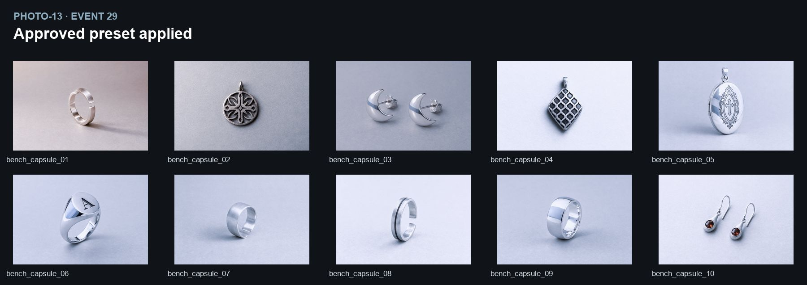

- **Action:** `image_apply_preset`
- **Decision:** Apply Creative - Cool Light once to every look-adjusted task image.
- **Parameters:** `{"presetName": "Creative - Cool Light"}`
- **Reasoning:** A single preset was used as a complete look; presets were not stacked.
- **Snapshot:** `trajectory/intermediate/29-approved-preset-applied.jpg` — 1800×638 JPEG, 87,298 bytes
- **SHA-256:** `760a2d67ac015984eef467838c2eba1bd738280a2dfa500c7e9e36c2305bf9c6`
- **Same bytes as prior step:** `false`

#### Underlying asset snapshots (10)

- [bench_capsule_01.png](underlying/stage-29-approved-preset-applied/001-photo-13-bench-capsule-01-preset-bench-capsule-01-png.jpg) — asset `PHOTO-13-bench_capsule_01-preset`; 1600×1067 JPEG; `57f1e7bc48cd9c751284af53eeb0f0546982eddce5ad5cc8fc7398e6bd6d2dcb`
- [bench_capsule_02.png](underlying/stage-29-approved-preset-applied/002-photo-13-bench-capsule-02-preset-bench-capsule-02-png.jpg) — asset `PHOTO-13-bench_capsule_02-preset`; 1600×1067 JPEG; `8f49b408260ca232470559b22616825ca587bcd68b1ab4201665e086d0800ddf`
- [bench_capsule_03.png](underlying/stage-29-approved-preset-applied/003-photo-13-bench-capsule-03-preset-bench-capsule-03-png.jpg) — asset `PHOTO-13-bench_capsule_03-preset`; 1600×1067 JPEG; `10f9b6a42eb1cefb13a3cd0fb1bf8c4938647475f6706e745511a82a962e4d83`
- [bench_capsule_04.png](underlying/stage-29-approved-preset-applied/004-photo-13-bench-capsule-04-preset-bench-capsule-04-png.jpg) — asset `PHOTO-13-bench_capsule_04-preset`; 1600×1067 JPEG; `1f45490d75d0d7dc250cfc697932a219ed8f4589956136a22e0d8882e878194e`
- [bench_capsule_05.png](underlying/stage-29-approved-preset-applied/005-photo-13-bench-capsule-05-preset-bench-capsule-05-png.jpg) — asset `PHOTO-13-bench_capsule_05-preset`; 1600×1067 JPEG; `c22a8db2aff69bfbaa405fb5a2f960211e1d077d7dd054aa884c01756e308c1e`
- [bench_capsule_06.png](underlying/stage-29-approved-preset-applied/006-photo-13-bench-capsule-06-preset-bench-capsule-06-png.jpg) — asset `PHOTO-13-bench_capsule_06-preset`; 1600×1067 JPEG; `0843b4b39356108b994cdb5d50bfba469162902188a8bebb47d319fb8768019f`
- [bench_capsule_07.png](underlying/stage-29-approved-preset-applied/007-photo-13-bench-capsule-07-preset-bench-capsule-07-png.jpg) — asset `PHOTO-13-bench_capsule_07-preset`; 1600×1067 JPEG; `8d8fd58629790832e22d3fe01081621b679c4f458cea61c2b95c3263ada04f2f`
- [bench_capsule_08.png](underlying/stage-29-approved-preset-applied/008-photo-13-bench-capsule-08-preset-bench-capsule-08-png.jpg) — asset `PHOTO-13-bench_capsule_08-preset`; 1600×1067 JPEG; `0160408f97de11d8ed01ef1775f13523b24670b03b3160383e6732d74c07a699`
- [bench_capsule_09.png](underlying/stage-29-approved-preset-applied/009-photo-13-bench-capsule-09-preset-bench-capsule-09-png.jpg) — asset `PHOTO-13-bench_capsule_09-preset`; 1600×1067 JPEG; `a62a7518fca21ddbf018f1276b9e360bd653b916f431216c87bc6e98d3753263`
- [bench_capsule_10.png](underlying/stage-29-approved-preset-applied/010-photo-13-bench-capsule-10-preset-bench-capsule-10-png.jpg) — asset `PHOTO-13-bench_capsule_10-preset`; 1600×1067 JPEG; `06b93c75ac87a1e1996f3c4a93a8cc83aa1d51520004bdc56ea397ffdf23594d`

### Stage 30 — Highlight/shadow fine-tune complete

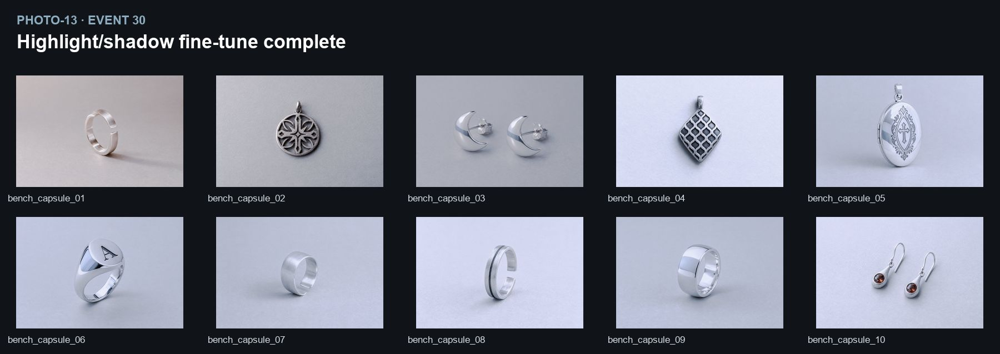

- **Action:** `image_apply_adjustments`
- **Decision:** All 10 final Adobe states are captured.
- **Parameters:** `{"darks": 40, "highlights": -60}`
- **Reasoning:** The preset outputs were visually inspected immediately before this final adjustment.
- **Snapshot:** `trajectory/intermediate/30-highlight-shadow-fine-tune-complete.jpg` — 1800×638 JPEG, 81,494 bytes
- **SHA-256:** `8d2be2851b2e3693697767127de95bb9f86fe777a78a6828024063ea73d7d867`
- **Same bytes as prior step:** `false`

#### Underlying asset snapshots (10)

- [bench_capsule_01.png](underlying/stage-30-highlight-shadow-fine-tune-complete/001-photo-13-bench-capsule-01-fine-tune-bench-capsule-01-png.jpg) — asset `PHOTO-13-bench_capsule_01-fine_tune`; 1600×1067 JPEG; `40ae2a27d6837d10be66dd0e87bc350d5d3063420488dd4d6c99062d761d646f`
- [bench_capsule_02.png](underlying/stage-30-highlight-shadow-fine-tune-complete/002-photo-13-bench-capsule-02-fine-tune-bench-capsule-02-png.jpg) — asset `PHOTO-13-bench_capsule_02-fine_tune`; 1600×1067 JPEG; `fd21638f084451ee4c410037cfb3f95e56cd327ed1c5b24c1fbd3e8b5bec0ce1`
- [bench_capsule_03.png](underlying/stage-30-highlight-shadow-fine-tune-complete/003-photo-13-bench-capsule-03-fine-tune-bench-capsule-03-png.jpg) — asset `PHOTO-13-bench_capsule_03-fine_tune`; 1600×1067 JPEG; `862e1a7c9cad85f837eb4fe5b4576570028bd45e4b665bd5d9115c4cbc0cdb18`
- [bench_capsule_04.png](underlying/stage-30-highlight-shadow-fine-tune-complete/004-photo-13-bench-capsule-04-fine-tune-bench-capsule-04-png.jpg) — asset `PHOTO-13-bench_capsule_04-fine_tune`; 1600×1067 JPEG; `57c4d0e207d3675891298a9e52a48185477f551df7ba8926067e5e9814317a20`
- [bench_capsule_05.png](underlying/stage-30-highlight-shadow-fine-tune-complete/005-photo-13-bench-capsule-05-fine-tune-bench-capsule-05-png.jpg) — asset `PHOTO-13-bench_capsule_05-fine_tune`; 1600×1067 JPEG; `62a0dd6ff333c1e6ef8789cc1c6ada759918f55147e2984e3bcf3b67229b325f`
- [bench_capsule_06.png](underlying/stage-30-highlight-shadow-fine-tune-complete/006-photo-13-bench-capsule-06-fine-tune-bench-capsule-06-png.jpg) — asset `PHOTO-13-bench_capsule_06-fine_tune`; 1600×1067 JPEG; `0b8a7278ce54326076fe540d9d92cba7e3eb989788d03a8d4af449852527f0ab`
- [bench_capsule_07.png](underlying/stage-30-highlight-shadow-fine-tune-complete/007-photo-13-bench-capsule-07-fine-tune-bench-capsule-07-png.jpg) — asset `PHOTO-13-bench_capsule_07-fine_tune`; 1600×1067 JPEG; `384e9275aeed48a50348dafccf5fc61cec793f26114372454c210a1cfb2759f5`
- [bench_capsule_08.png](underlying/stage-30-highlight-shadow-fine-tune-complete/008-photo-13-bench-capsule-08-fine-tune-bench-capsule-08-png.jpg) — asset `PHOTO-13-bench_capsule_08-fine_tune`; 1600×1067 JPEG; `4e32af709569722d5618b9edea1b5a8e03f8216b2329564765039abe7fdf291a`
- [bench_capsule_09.png](underlying/stage-30-highlight-shadow-fine-tune-complete/009-photo-13-bench-capsule-09-fine-tune-bench-capsule-09-png.jpg) — asset `PHOTO-13-bench_capsule_09-fine_tune`; 1600×1067 JPEG; `c9179e986e1457fdbcf2fabb14b2f1cde56120addea23d33e29a93a922cf78f6`
- [bench_capsule_10.png](underlying/stage-30-highlight-shadow-fine-tune-complete/010-photo-13-bench-capsule-10-fine-tune-bench-capsule-10-png.jpg) — asset `PHOTO-13-bench_capsule_10-fine_tune`; 1600×1067 JPEG; `5beeaf45b55e62d8453f986bf5cd20df25a796bb864f52f16df64cc0e2a9d587`

### Stage 31 — Full graded-set visual QA

- **Action:** `visual_quality_review`
- **Decision:** Accept the complete graded set for layout assembly.
- **Parameters:** `{}`
- **Reasoning:** The review checked material/color identity, clipping, highlight detail, shadow detail, and composition continuity.
- **Snapshot:** `trajectory/intermediate/31-full-graded-set-visual-qa.jpg` — 1800×638 JPEG, 78,816 bytes
- **SHA-256:** `b58dbc964099d583f466eeef0f0f35934776e6f888e38a460d8f3ebe5633f1f9`
- **Same bytes as prior step:** `false`

### Stage 32 — No-crop decision confirmed

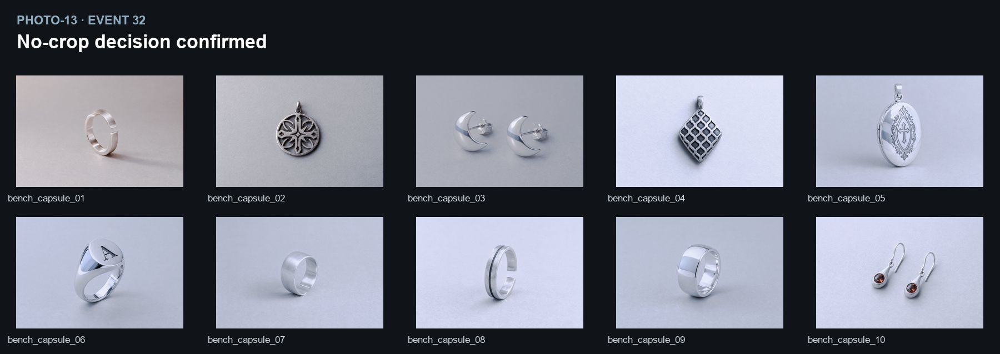

- **Action:** `preserve_composition`
- **Decision:** Retain the original product framing and negative space for all ten images.
- **Parameters:** `{}`
- **Reasoning:** No crop operation was needed; the open field is part of the approved house look.
- **Snapshot:** `trajectory/intermediate/32-no-crop-decision-confirmed.jpg` — 1800×638 JPEG, 79,473 bytes
- **SHA-256:** `18647e0313e8b42a04ff50d648e6c394e6a981986df619550d21861cfa046423`
- **Same bytes as prior step:** `false`

### Stage 33 — Print specification resolved

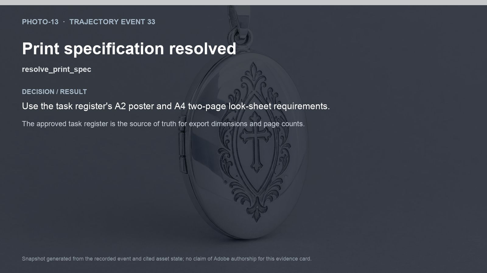

- **Action:** `resolve_print_spec`
- **Decision:** Use the task register's A2 poster and A4 two-page look-sheet requirements.
- **Parameters:** `{}`
- **Reasoning:** The approved task register is the source of truth for export dimensions and page counts.
- **Snapshot:** `trajectory/intermediate/33-print-specification-resolved.jpg` — 1600×900 JPEG, 78,289 bytes
- **SHA-256:** `9968075b03fd01dc1712f4c96bf05abd691948b54d2cd96c8465bc6eb3a92272`
- **Same bytes as prior step:** `false`

### Stage 34 — Maker mark decision

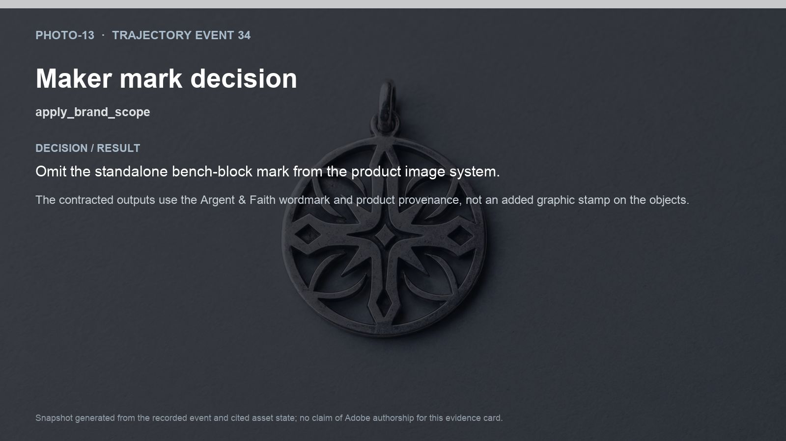

- **Action:** `apply_brand_scope`
- **Decision:** Omit the standalone bench-block mark from the product image system.
- **Parameters:** `{}`
- **Reasoning:** The contracted outputs use the Argent & Faith wordmark and product provenance, not an added graphic stamp on the objects.
- **Snapshot:** `trajectory/intermediate/34-maker-mark-decision.jpg` — 1600×900 JPEG, 90,832 bytes
- **SHA-256:** `7560ac49a10abf23b489a64492a8fcf80366446c8b2945610046c783af6f4f17`
- **Same bytes as prior step:** `false`

### Stage 35 — Typography and template decision

- **Action:** `compose_layout`
- **Decision:** Use a restrained serif display face with neutral sans-serif specifications and tabular pricing.
- **Parameters:** `{}`
- **Reasoning:** The design keeps photography primary and provenance quiet.
- **Snapshot:** `trajectory/intermediate/35-typography-and-template-decision.jpg` — 1600×900 JPEG, 80,423 bytes
- **SHA-256:** `cebce1c6169f34063cfebaf9688da37fe4ceb7f0fad4c4e4060ae970bb9bb9e5`
- **Same bytes as prior step:** `false`

### Stage 36 — First product-detail layout

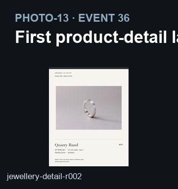

- **Action:** `local_pillow_layout`
- **Decision:** Establish the 1440×1800 product-detail system on Quarry Band.
- **Parameters:** `{}`
- **Reasoning:** The layout preserves the approved Adobe photograph and adds only typography, rules, and product metadata.
- **Snapshot:** `trajectory/intermediate/36-first-product-detail-layout.jpg` — 360×383 JPEG, 13,056 bytes
- **SHA-256:** `83742f79b073791bfc070e17d1d8a91c7c079a2fa36ee087b61310cae4de02c6`
- **Same bytes as prior step:** `false`

### Stage 37 — Ten product details exported

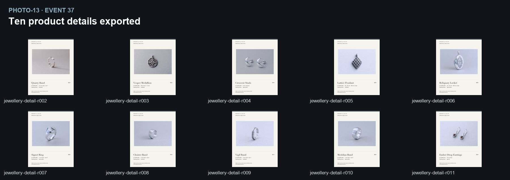

- **Action:** `export_png`
- **Decision:** Export one 1440×1800 PNG for every inventory row r002-r011.
- **Parameters:** `{}`
- **Reasoning:** Each detail retains its bound name, SKU, finish, dimension, and price.
- **Snapshot:** `trajectory/intermediate/37-ten-product-details-exported.jpg` — 1800×638 JPEG, 70,344 bytes
- **SHA-256:** `4400f4248ff3db3ae3867356d11276ecf5a366e9aa86b4b968cce5283768c332`
- **Same bytes as prior step:** `false`

### Stage 38 — Poster layout assembled

- **Action:** `local_reportlab_layout`
- **Decision:** Use Reliquary Locket as the primary image, with Quarry Band and Ember Drop Earrings secondary.
- **Parameters:** `{}`
- **Reasoning:** The asymmetrical A2 composition keeps the objects large, cool, and surrounded by air.
- **Snapshot:** `trajectory/intermediate/38-poster-layout-assembled.jpg` — 360×383 JPEG, 12,984 bytes
- **SHA-256:** `9c7baf15a0705652b00d0865a594c5dabdd4949b6f26996c7a1101be09ae748c`
- **Same bytes as prior step:** `false`

### Stage 39 — Poster rendered and inspected

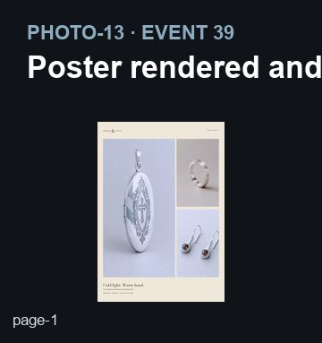

- **Action:** `verify_pdf_render`
- **Decision:** Approve the final one-page A2 poster render.
- **Parameters:** `{}`
- **Reasoning:** The rendered page shows no clipping, broken images, overlap, or unreadable copy.
- **Snapshot:** `trajectory/intermediate/39-poster-rendered-and-inspected.jpg` — 360×383 JPEG, 13,033 bytes
- **SHA-256:** `61e5e87d732329e512faf17a525b510ae4998bbd9bc9b54c648a17a0973b78a1`
- **Same bytes as prior step:** `false`

### Stage 40 — Look sheet page 1 rendered

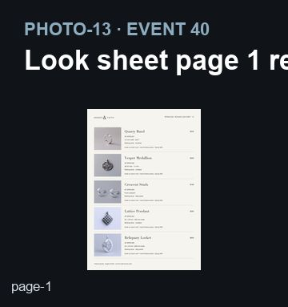

- **Action:** `verify_pdf_render`
- **Decision:** Approve inventory rows r002-r006 on A4 page 1.
- **Parameters:** `{}`
- **Reasoning:** Names, SKUs, dimensions, finishes, and prices remain aligned and legible.
- **Snapshot:** `trajectory/intermediate/40-look-sheet-page-1-rendered.jpg` — 360×383 JPEG, 13,090 bytes
- **SHA-256:** `09602fac43c368b6be5edb749482daebc4784851e7eb62757e5f167c4b18e630`
- **Same bytes as prior step:** `false`

### Stage 41 — Look sheet page 2 rendered

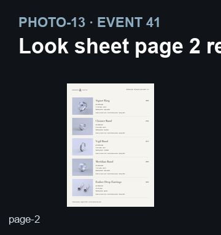

- **Action:** `verify_pdf_render`
- **Decision:** Approve inventory rows r007-r011 on A4 page 2.
- **Parameters:** `{}`
- **Reasoning:** The duplicate ‘sterling silver’ phrase on Ember Drop Earrings was caught, corrected, rebuilt, and re-rendered.
- **Snapshot:** `trajectory/intermediate/41-look-sheet-page-2-rendered.jpg` — 360×383 JPEG, 13,042 bytes
- **SHA-256:** `8550641fcf3874019c1dc5167ec229cacb3e87aedc5e8ccd4d60e7816b53ca48`
- **Same bytes as prior step:** `false`

### Stage 42 — Inventory binding verified

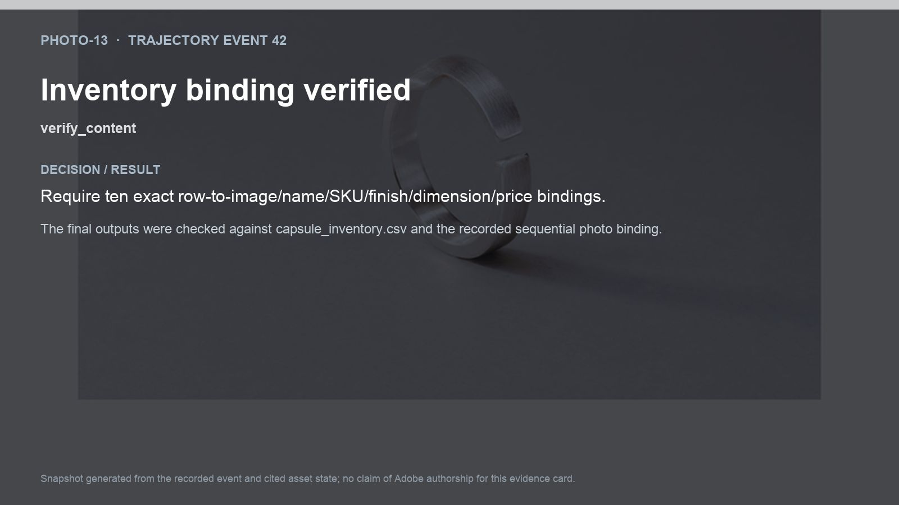

- **Action:** `verify_content`
- **Decision:** Require ten exact row-to-image/name/SKU/finish/dimension/price bindings.
- **Parameters:** `{}`
- **Reasoning:** The final outputs were checked against capsule_inventory.csv and the recorded sequential photo binding.
- **Snapshot:** `trajectory/intermediate/42-inventory-binding-verified.jpg` — 1600×900 JPEG, 62,512 bytes
- **SHA-256:** `80ecc20ffc0872f35a11cd9a50c84a36b8635547a3b2987a8a55e7ef84a52294`
- **Same bytes as prior step:** `false`

### Stage 43 — Technical output verification

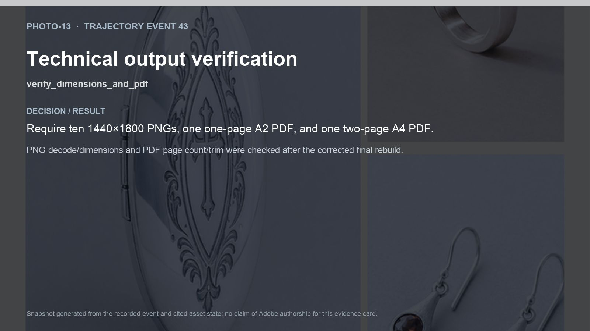

- **Action:** `verify_dimensions_and_pdf`
- **Decision:** Require ten 1440×1800 PNGs, one one-page A2 PDF, and one two-page A4 PDF.
- **Parameters:** `{}`
- **Reasoning:** PNG decode/dimensions and PDF page count/trim were checked after the corrected final rebuild.
- **Snapshot:** `trajectory/intermediate/43-technical-output-verification.jpg` — 1600×900 JPEG, 86,044 bytes
- **SHA-256:** `34760c0e5c759afe89024ac17580071cfae368fac28a3f4b36adee7b11877d5e`
- **Same bytes as prior step:** `false`

### Stage 44 — Final deliverable visual review

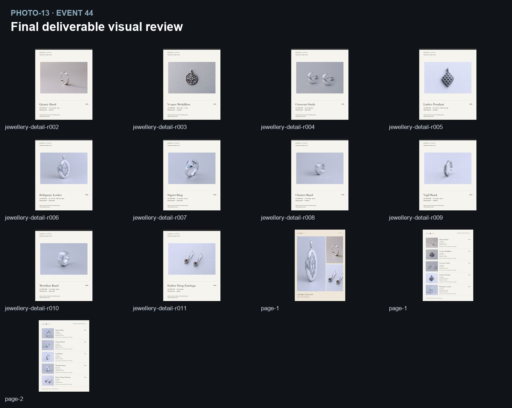

- **Action:** `visual_quality_review`
- **Decision:** Approve all ten product details, the poster, and both look-sheet pages for release.
- **Parameters:** `{}`
- **Reasoning:** The final renders retain silver identity, oxidized recess detail, open compositions, controlled highlights, and garnet fidelity.
- **Snapshot:** `trajectory/intermediate/44-final-deliverable-visual-review.jpg` — 1440×1148 JPEG, 90,859 bytes
- **SHA-256:** `dd7ab308dc9b645be8b342bd78d20fa94bd8f3e68c9e9d04ed553297f6f09aa1`
- **Same bytes as prior step:** `false`

### Stage 45 — Release package prepared

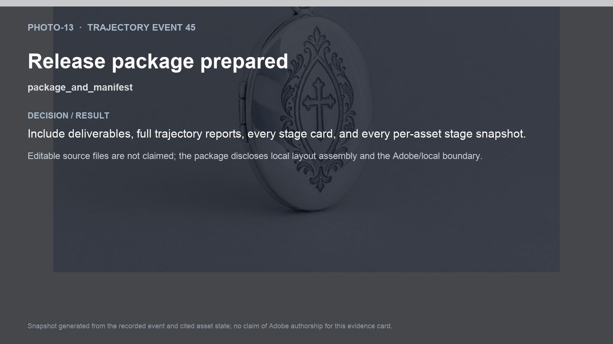

- **Action:** `package_and_manifest`
- **Decision:** Include deliverables, full trajectory reports, every stage card, and every per-asset stage snapshot.
- **Parameters:** `{}`
- **Reasoning:** Editable source files are not claimed; the package discloses local layout assembly and the Adobe/local boundary.
- **Snapshot:** `trajectory/intermediate/45-release-package-prepared.jpg` — 1600×900 JPEG, 75,068 bytes
- **SHA-256:** `ccf3c9647e191fdbb9d8cad4cf84bcc2014589422f2ae6342cf3549eee0d80e9`
- **Same bytes as prior step:** `false`

## Recorded retries and recovery

- `{"failure": "Adobe rejected the public annotation S3 source domain as untrusted.", "recovery": "Downloaded the canonical public sources and uploaded them to Adobe Creative Cloud in one 22-file ingestion call.", "stage": "source-ingestion-preview", "status": "recovered"}`
- `{"failure": "Legacy fit=contain parameter was rejected by the current crop/resize schema.", "recovery": "Retried proportional width-only preview scaling.", "stage": "preview-downscale", "status": "recovered"}`
- `{"failure": "A single 22-image request returned only the first 10 outputs.", "recovery": "Retained those 10 and processed the unreturned 12 in chunks of 10 and 2.", "stage": "auto-straighten", "status": "recovered"}`
- `{"failure": "Two concurrent 10-image requests returned Adobe transport HTTP 504.", "recovery": "Retried the first 20 images sequentially in four chunks of five; the final two-image chunk had already succeeded.", "stage": "auto-tone", "status": "recovered"}`
- `{"failure": "Sandbox DNS blocked direct resolution of photoshop-api.adobe.io.", "recovery": "Used the approved escalated curl network path and parallel downloads.", "stage": "local-preservation", "status": "recovered"}`
- `{"failure": "Initial sequential download was too slow for 22 full-resolution PNGs.", "recovery": "Canceled the sequential transfer and restarted with curl parallelism capped at eight.", "stage": "local-preservation", "status": "recovered"}`
